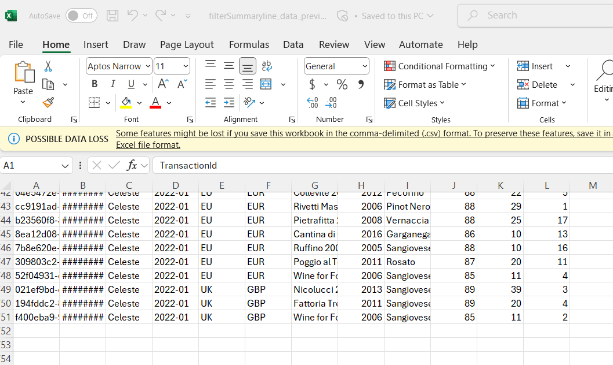
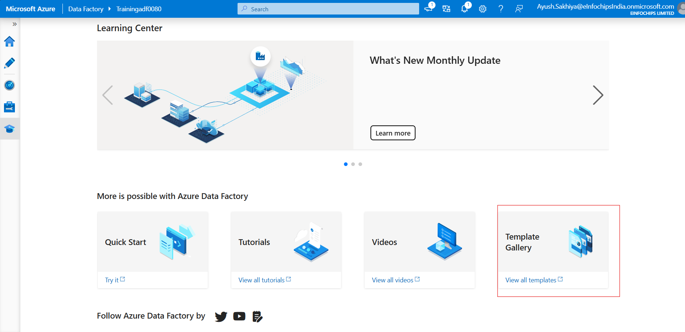
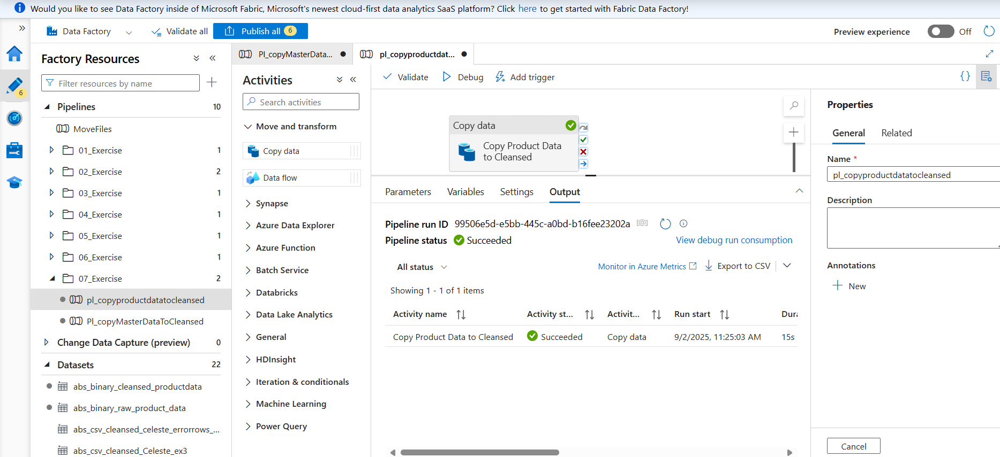
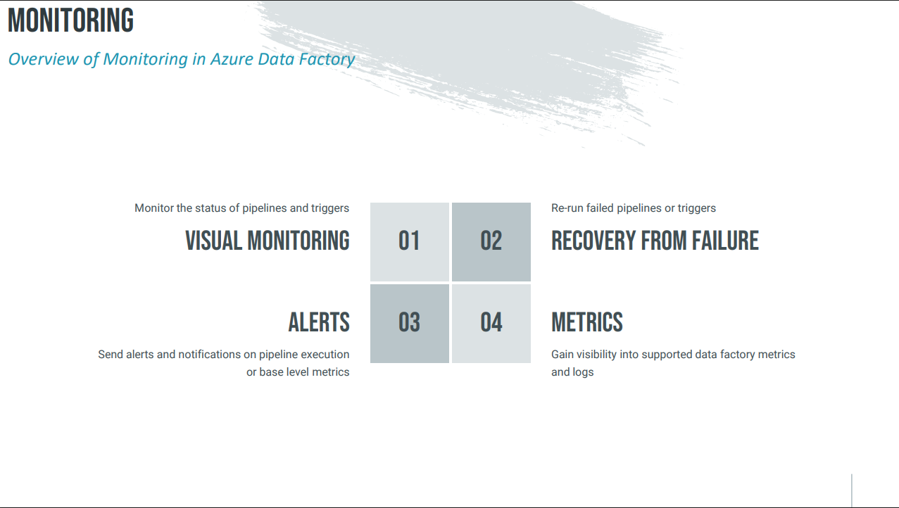

# Azure Data Factory 

- ADF managed service in the cloud for scale-out serverless data integration, data transformation and orchestration 
  - Azure data factory is PaaS service , so we don't requried to manage the patching , upgrading, maintaining and provisioning infrastructure on cloud and on-premises etc and there is no upfront costs. 
### Architectural Pattens for Analytics

 -  Ingest layer: 
    -  This is where we collect source data from diff sources and formats.We can get Structured data from an On-premise Database.We can get semi-structured data like CSV, JSON files. 
 - Store / Process layer : 
    - Stores the Ingested data in Azure data lake Gen2 Storage type
 - Enrich layer : 
    - We transform and enrich those processed data using Azure machine learning to apply ML Models on processed data.

   - We will refine, reshape the data for diff purposes like data warehouse and Machine Learning.
- Serve layer : 
   -  We can serve data for diff purpose for diff users and apps.
   - We can use Power BI to create dashboards and create reports on the data,
   - We can use Azure data share to share the data with external parteners.

### Architecture of hands-on project :

#### 

 1. Landing - The data arrive to this containers.
Just drop data as it is. No changes.

2. Raw - The raw data like json and csv file will be stored here without process.
Data is still unstructured but you organized it by folders, date etc.

3. Cleansed - Cleaned, stores Unique data and remove duplicates.
we will process the data from cleansed contianer into a staging layer within Azure SQL DB.

4. Curated Layer: In this final stage, the data is aggregated, joined, and modeled for a specific purpose. It's now ready for consumption.

Staging layer (Azure SQL DB)

Before holding into the data warehouse, data is stored in staging area where:
Temporary holding place for data
Used for validation, consistency check,
Make sure data is clean before final load to warehouses like Azure SQL DB

- the final data warehouse DWH. from this DWH we can serve the data for end user and applications via creating dashboard by Power BI.

- For delta lake, we will process the data from staging layer and bring it into Curated container in a delta lake formate using Azure Databricks.The delta lake supports for transactions like a DB.

- We will serve the data to end user via dashboards using Power BI.

- Azure Data Bricks for build the delta lake structure in azure delta lake storage Gen2

- Azure Data Factory - For Data pipeline and Orchestrations.

- Azure Data lake storage Gen2 - for Store the lot of data from multiple Data Sources.

- Azure SQL DB - For data warehouse

- created storage account with Enabled hierarchical namespace

- created azure SQL database 
  

- created azure data factory 

#### building a data pipeline

 #####  main components of data factory :

 1. Pipelines : logical grouping of activities needed to process.
 - The data pipeline can have one or more activities.
 - For example, we can have a pipeline consisting of a copy activity and a transform activity.

 2. Activities : Activities are the fundamental steps performing specific actions within a pipeline.

   - 3 types of activities 
      1. Data Movement Activities :Copy Activity to copy data from a source to a sink

      2. Data Transformation Activities : Change data – native Data Flows or External Service ex : filtering data , aggrigating data, change th eformate of the data 

      3. Data Control Activities : Logical control activities such as for each, conditions etc

 3. Linked Services :these are like connection strings that connect to our data sources. ex link data source to data set

 4. Datasets : The representation of the data that we work with is called a data set.

 5. Integration Runtime :  it is kind of the bridge between activities and linked services.

 6. Triggers :  triggers a kind of like switches to execute a pipeline.Pipelines can either be manually executed or by using a trigger.

- created two Container in  Storage account 1. landing 2. raw

- upload file in to landing Container
 

- creating pipeline in ADF
  
    - create new test connection and five storage account and subscription id and then test connection

    
   
    - than load file 

      

    - Destination data store : give Destination as a raw container

       
       

    - than go to monitor 

         

      

     - now created new folder in pipeline and move created piline into folder 
      

     - now created new folder in datasets and move datasets  into folder 
      

     - now created new container
       

     - now create new pipeline to copy data from raw container to cleansed  container

     

     
     
       
     

  - now created new folder in pipeline and move created piline into folder and also same for created new folder in datasets and move datasets  into folder 
     

- Activities : An activity is the single task within a pipeline

  1. Data Movement Activities : Task to move data from a source to a sink e.g. Copy Activity
   - Multiple types of data stores supported as source / sink in ADF
   

  2. Data Transformation Activities : Task to change data e.g. Data Flow Activity
   - Mostly external ADF activities such as – Databrick
Notebooks, Azure Functions, Stored Procedures  
     

  3. Control Flow Activities : Task for logical control flow e.g. If condition, Foreach Loop
   - Mostly native ADF activities to loop, to branch or to set
variables
   
 
 - Activity Dependencies : 

  

  - Success : Activity B starts only if Activity A has
completed successfully

  

- Failure : Activity B starts only if Activity A has failed
  
     
- Completion : Activity B starts as long as Activity A has
completed 
  

- Skipped : Activity B starts if Activity A was skipped
  

- Copy Activity : 
  - Copy Activity power measured in DIUs Combined measure of CPU, Memory and Network Usage

  - Degree of Parallelism : Parallel execution of copy activity
     - Define number of threads to read multiple files simultaneously

- Expressions and Variables : Expressions and variables allow ADF
pipelines to be dynamic

   - Expressions : Property value evaluated during pipeline execution
     - Expressions can be created via the Expression builder in ADF
Note: ADF expressions are case-sensitive
     - Expressions can be string literals, variables or functions

  - Variables : Properties that can be set and modified during a pipeline run
    - Expressions can be specified for a variable
    - User Variables scoped at pipeline level accessible to all activities in the pipeline
    - System variables provide access to runtime values of various system properties

- Parameters : Values provided to a Pipeline and cannot be modified during a pipeline run.
  - Controls the behaviour of a pipeline and its activities  
    1. Runtime Parameter : 
       - Pipeline parameter – runtime parameter for an ADF pipeline
       - Dataset parameter – runtime parameter for an ADF dataset
       - Linked Service parameter – runtime parameter for an ADF linked service

    2. Optional Parameter :
       - Runtime parameter that can be made optional by defining a default value
       Default value used when no parameter value is provided

    3. Global Parameter : Constant value scoped at the data factory instance
        - Shared by all pipelines
        - Do not enable runtime value substitution and treated as
          constants
  

- Azure Key Vault : 

     - Secret Management : Securely store and tightly control accessto tokens, passwords, certificates, API keys, and other secrets

    - Key Management : Used as a Key Management solution, so we can create and control the encryption keys used to encrypt your data.
   
    - Certificate Management : Provision, manage, and deploy certificates for use with Azure

   -  created key vault 
      

   - store storage account access key into the key vault 
      
        

   - Factory cannot use the secrets that are stored within the Key Vault instance until we grant the appropriate permissions.
   The Data Factory instance has a managed identity that is created automatically when the Data factory instance was created.We need to grant access to this identity.   

    Key vault > Access policies

   
   
   
      
  - created New linked service using key vault 

  

 - now go to the create link service and choose Account selection method and select connection type as  azure key vault 

 - so this is use to link service that retrieves the storage account details from Azure Key Vault.

   

 - now create new pipeline and in the activities section select get metadata

     

- go to the setting select new data set and select Azure Data Lake Storage Gen2 > JSON > and select link service 
  

- In the drop down for field list,select child   items.This basically identifies that we want to get all the items within this data set.  

 

- now go to the activities > Iteration & conditionals  and choose for each 
  - We want to start the for each activity.After the get metadata activity succeeds.to connect these activities with the on success dependency.

- we are taking the output of our metadata activity, which is called get file list and getting the list of child items from this output.   

 

- now take Iteration & conditionals > foreach and set copy dataactvity and give source as a raw container files ans sink as a
cleansed container 

  

- now created parameters  for source data
  
    
  

- now created parameters  for  data
  
  
  

- and select copy behaviour as a flatten hierarchy as  We want to select this since we want to convert the Json file, which is a hierarchical structure,
and flatten it to a CSV file that has no hierarchies. 

- map the values of fields

#### Mapping Data Flows
 
 - data flow :  data flow is a visual tool that allows you to design and build data transformation logic without writing code. This is a key component of ADF, designed for data engineers to create complex data workflows using a drag-and-drop interface. The data flows are then executed on scaled-out Apache Spark clusters managed by Azure, which handles all the code translation and optimization behind the scenes

 

 

  -  in data flow if we need to add  transformation to press + 

    

  - add new branch 
    

-  created new pepeline  with add dataflow 

- adding  a filter transformation to our data flow so as to remove the summary line from the source files.

before 

after 

- now aggregate the daily sales so that we have only the monthly sales for each product within our sales data.

 - now add aggregate transformation and group by all columes

 

 
 

 - added sink transformation
   

 - ADF data flows execute on spark, it splits the data into the most optimal partition configuration automatically.
  - In this scenario, ADF split the file into partitions and copied them to the destination.
  - If we want to ensure that we get the same file name and the same number of files as we have in our source,then we need to change the file name option in the sync settings.
 
  

  now add derived column to set file name as store and month of sales with year 
  

  
  

 - created dataflow source  as Azure SQL database 
   

#### Implementing Flowlets

   - Flowlets are reusable containers of activities that can be used in multiple data pipelines.

   

  - created new flowlet
    

#### Controlling Pipeline Flow
  
   - Assert transformation : 
     

   - created Assert transformation to salesregion is EU or UK if one of the region is not there than that showing NULL value
     
     

     - Asserts  Identifying Error Rows : add derived columen transformation if its not a EU or UK than error row is showing true
    
    

     - split the error rows and the clean rows into two separate streams.
        - added conditional split 

        

        
        
        

       - added addErrorFileName
        
       

     - Error Handling  
       

         - implemented pipeline error handling and captured the error messages to variables,  so we have created two variable and than write the error to a log file. using data copy 

     
     
     
     

     - Building Pipelines using Pre-Built Templates
       
      
      

#### Building the Data Warehouse  

 
 

    - in  the data warehouse the data process involves three main steps extraction, transformation and loading. (ETL)

  - created stage table in azure aql database 

      

  - created data warehouse table in azure aql database 
  

 - build an ADF pipeline to copy master data files from the raw container to the cleansed container. 

 

   - For the file path type to select the option Wild Card file path.This basically is saying we want to copy all the files with a particular wild card from the specified folder.
   
   
   

     - completed copy masterdata from raw container to cleansed container 

      

 - copy the product data from the raw container to the cleansed container.
   - with large CSV files, sometimes the escape characters and the delimiters can cause issues with the copy process.So in such cases it is better to copy the files as a binary copy.
  
  
  
  

   -  completed copy prouctdata from raw container to cleansed container

    

- loading the data from the cleansed container into the staging tables in Azure SQL DB.
 

   - create the parameter driven data sets for our metadata pipeline to load the files from the cleansed container into the staging tables in Azure SQL DB.
     
     - The first step is to add the source and sink data sets to ADF one for the blob storage and one for SQL For each data set, we will retrieve the parameters dynamically at runtime.
       
        
     1. add source datasets
     -  We want to configure the container directory and the name of the file at runtime. add parameters to the data set for the folder and for the file name and for the delimiter.
      
    - assign the parameters to specific fields of the configuration.
     

    2.  add sink datasets
    -  add a sync data set which connects to Azure SQL db.choose Azure SQL database as the data store.
       
        
       - created a new linked service to Azure SQL DB.
         

      - leave the table name emptywe will specify dynamically at runtime, need to check the edit box  
          

        created parameters for table name and assigned to connection 
         
         

  - create the metadata pipeline to load the files from the cleansed container into the staging tables in Azure SQL db. 

      - add a lookup activity to our pipeline. retrieve data from the ADF underscore metadata table, we can specify the query in the settings tab of the lookup activity.
         

     - uncheck to show all row in table
         
    
     - on success from the get metadata to the for each activity on the settings For the for each activity,  Add Dynamic Content on the items field. select the output of the lookup activity.the end of the expression  the dot value. 

      
     

    - Now if we run this pipeline multiple times, the data would be inserted multiple times into the target staging tables.So we need to make sure that the staging tables are cleared before each data load.In the pre copy script field, we can specify an expression that truncates the destination table.

     TRUNCATE TABLE  stage.@{item().TableName}
      

     

- Dimensions  :

  
  

 - data warehousing and ETL (Extract, Transform, Load) processes, Slowly Changing Dimensions (SCDs) are a set of techniques for handling changes to data in a dimension table. A dimension table contains descriptive attributes that are relatively static, such as a customer's address, a product's name, or an employee's job title. When these attributes change, you need a strategy for managing that change without losing historical context.

   - The different types of SCDs are defined by how they handle these changes.

     - Type 0: Retain Original: This is the simplest approach, where you don't track any changes at all. The original data is kept, and any updates are simply ignored.

       Use Case: For attributes that should never change, such as a person's date of birth, a product's release date, or a Social Security Number.

     - Type 1: Overwrite: The new data overwrites the old data directly. This means the historical information is lost.

       Use Case: When you only care about the most current information and historical data is not needed for analysis. For example, if a customer's phone number changes, and you only need their current number for communication.

     - Type 2: Add New Row (Historical Tracking): This is one of the most common and powerful methods. When a change occurs, a new row is added to the dimension table to store the new information. The old row is marked as inactive, and the new row is marked as active. This preserves the complete history of a dimension record.

       Implementation: This is typically done by adding columns like:

       A start date and end date to define the period a record was valid.

       A current flag (e.g., 'Y'/'N' or true/false) to indicate the active record.

       Use Case: When you need to perform historical analysis, such as seeing what products a customer bought while they lived at a specific address, or what sales a region generated while a specific manager was in charge. 

#### Building the Delta Lake
  - The curated container is where highly refined and structured data is stored, ready for consumption by business users, analysts, and applications. This data is transformed and optimized for a specific purpose.

  - Creating a Delta lake provides the possibility for it to be used for different downstream use cases,such as traditional BI, or for reporting with power BI or for machine learning.

 ##### Azure Databricks :
  - Azure Databricks is a unified, cloud-based data and AI platform designed to simplify big data processing, data science, and machine learning. It's a key service within Microsoft's Azure cloud and is built on top of Apache Spark, a powerful, open-source distributed processing engine.

 - Think of it as a comprehensive workbench for all things data. Instead of having to manage a complex Apache Spark cluster yourself, Azure Databricks provides a fully managed, optimized, and collaborative environment that handles the infrastructure for you.

 - Common Use Cases
     - ETL and Data Engineering: Building and managing large-scale data pipelines for ingesting, transforming, and loading data into a data warehouse or data lake.

    - Data Science and Machine Learning: Developing and training machine learning models on massive datasets. This is where Databricks' collaborative notebooks and optimized Spark engine shine.

   - Real-Time Analytics: Processing and analyzing streaming data from sources like IoT devices, social media, or web applications to gain real-time insights.

   - Business Intelligence and Reporting: Providing a high-performance data backend for BI tools like Power BI, allowing for fast and efficient queries on large datasets.

   

  - created databricks 
    
    

  - created single node(driver node) cluster  
     

   -  Executing Databricks Notebook from Data Factory 

       - created linked service to databricks from data factory
         

       - created new pipeline in to ADF 
       
         

        - give notebook path 
         

#### Presentation Layer : 

  - connected azure Sql database to Power BI
    
    

    

#### Triggers :  

 - In Azure Data Factory (ADF), a trigger is a unit of processing that determines when a pipeline should run. Instead of manually running a pipeline every time you need it to execute, you can use a trigger to automate the process based on a schedule, a specific event, or a time window.

 

 - create mster pipeline to chain pipelines together and create a master pipeline for the ETL or ELT process.
   
   

 - Event-based triggers  when new blobe will created then 
   

 - Scheduling Pipeline
   

- Tumbling Window Trigger
 

#### Monitoring : 
 

 - Pipeline recovery : the process of automatically resuming a failed pipeline run from a specific point, rather than restarting it from the beginning.

 - Setup Alert : 

    
    

 - metricks  azure portal > Monitor > Metricks 
   
 

    

      

     
        

 

 

   

 
              

