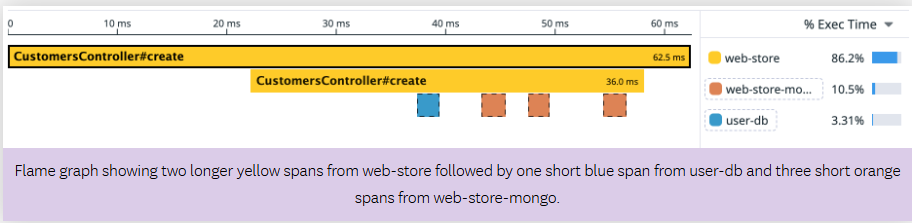

# DataDog-Site Reliability Engineer Learning Path

### APM Metrics & Traces :

- APM collects two primary types of data:

  - Metrics :  represent aggregated data that summarizes service performance, such as number of requests, response times, error count, and resource usage, which provides a high-level view of how services perform over time.
  - Traces : are detailed records of individual requests as they flow through services, showing how long each part of a request takes, dependencies among services, and where any errors occur.

#### APM Essentials: Metrics

 - The data collected through APM reveals typical usage patterns, highlights anomalies, and provides insights into service health and performance. Trace metrics in APM capture request counts, error counts, and latency measurements for 100% of application requests 
   - RED metrics: Rate, Errors, Duration

     - Rate (throughput) : The number of requests a service processes per second.

     - Errors : The number of requests that fail.

     - Duration (latency) : The time it takes for a service to process a request.

#### APM Essentials: Traces

- While metrics provide an overview of service performance, traces let you zoom in to follow the path of individual requests through your services. This level of detail shows how specific operations contribute to the metrics you’re monitoring.

   - In Datadog, a trace is represented as a flame graph (shown below), which visualizes the execution path of a request across distributed services. Each operation in the request is displayed as a horizontal bar called a span.
    

### Infrastructure and Cloud Network Monitoring

####  infrastructure Monitoring
- infrastructure refers to the underlying foundational components that support developing, running, and scaling your applications and websites. This includes physical hardware, virtual resources, containers, cloud services, and more.

#### Cloud Network Monitoring (CNM)

- Monitoring network communications between application components is important because while elements of your infrastructure can be individually healthy, issues can still exist in the communication between them.

- Cloud Network Monitoring (CNM) provides an additional layer of visibility into network traffic between services, containers, availability zones, and any other tag in Datadog. This is beneficial for several reasons:

  - Identifying and resolving networking issues: CNM detects problems such as DNS failures, latency spikes, and congestion.

  - Pinpointing unexpected service dependencies: Identify outages caused by cloud provider regions or third-party tools.

  - Tracking packet loss: Detects hardware issues, misconfigurations, or overloaded routers.

  - Optimizing costs: Reduce unnecessary cross-region traffic, decommission idle resources, and analyze traffic patterns to fine-tune load balancing.

  - Enhancing security: Detect unusual traffic patterns, unauthorized communications, and potential security threats. (Security is not covered in this course. For more information, refer to Datadog’s security courses and documentation.)

  - Visualizing service dependencies: CNM maps data flow between services, helping teams understand dependencies and bottlenecks.

  ### Service Level Objectives (SLOs)

- A Service Level Objective (SLO) is a measurable and quantifiable performance target that defines the acceptable operational goals for a service. It sets specific thresholds for key metrics, such as uptime, latency, or error rates. This ensures that the service meets both business requirements and user expectations. By setting these goals, businesses create a way to track the health of their services over time.

  - Metric based SLOs:
    - Metric based SLOs focus on tracking a single performance metric, such as uptime, response time, or error rates. These SLOs are built by picking a Service Level Indicator (SLI) that measures key aspects of a service’s performance or reliability. Metric based SLOs are best for straightforward performance tracking. Some examples include:

       - Uptime: Ensuring that a service is available a certain percentage of the time
       - Latency: Monitoring the speed of API responses or page load times 
       - Error Rate: Tracking the percentage of failed requests

  - Monitor based SLOs
     - Monitor based SLOs track performance and reliability using Datadog monitors. Monitors allow greater levels of complexity in what’s being tracked in the application. Suppose that the application that needs to be tracked is deployed across multiple regions around the globe. A monitor based SLO would allow a monitor to be created to track performance in each region. The data would then be summarized as a target, allowing the performance to be tracked globally.

       Some additional examples include:

       - Downtime Alerts: Monitoring the percentage of time a service is online without triggering downtime alerts
       - Error Thresholds: Tracking how often error thresholds are exceeded within a specific window     

  - Time Slice SLOs
      - Time slice SLOs focus on monitoring service performance within smaller, consistent time intervals. Monitor and metric based SLOs are going to average out the performance of the metric or alarm and compare that against the established SLO goal. Time slice SLOs evaluate whether the service meets its performance goals in each defined interval, such as every five minutes or an hour. Time slice SLOs help to ensure that performance remains steady and identifies short term issues that could impact user experience.

        Time slice SLOs are best for tracking consistent reliability over time. Some examples include:

        - Response Times: Monitoring the percentage of time a service is online without triggering downtime alerts
        - Throughput: Tracking the percentage of time a service handles enough requests each minute to keep up with demand

  - Burn rate

       - Imagine that you’ve just set up your very first error budget alarm for the AI image generator service. You’ve created a warning threshold to let you know when 50% of your error budget has been used. 5 minutes after creating the alarm, you happen to notice that you’ve already used up 49% of your budget. Even though you didn’t get an alarm, would you want to know how quickly that budget is being consumed?

          - This is where another SLO concept known as a burn rate can help you out. A burn rate tracks how fast, relative to the SLO, the service is consuming the error budget. 

