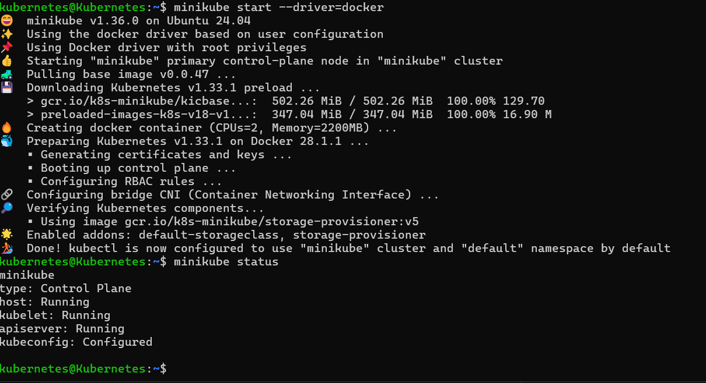
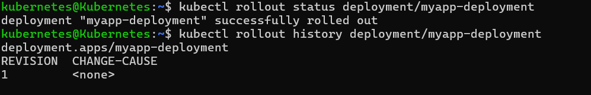
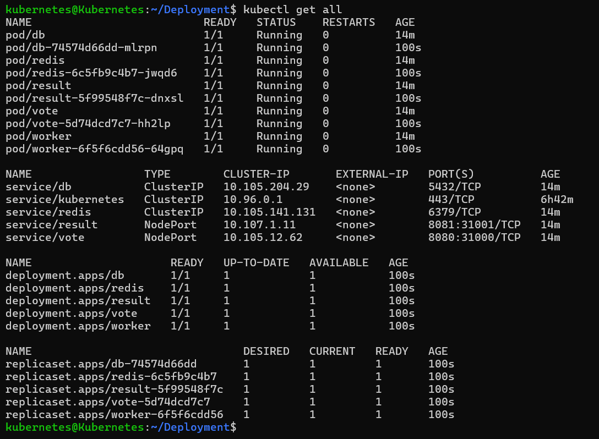

# Kubernetes 
- container orchestration - manages and deploys thousands of containers in a cluster

- Cluster :

  - cluster is the highest level of the hierarchy. It is a collection of physical or virtual machines that are all working together to run your containerized applications. A cluster consists of at least one Control Plane and one or more Nodes. The control plane manages the cluster, and the nodes run the applications.

- Node
  - node (formerly called a "minion") is a worker machine in the Kubernetes cluster. It can be a physical server, a virtual machine, or a container that runs the applications. Every node has a kubelet agent, which communicates with the control plane and ensures that the containers on that node are running correctly.

- Pod
  - A pod is the smallest and most basic unit of deployment in Kubernetes. A pod is a single instance of a running application. It's a group of one or more containers that share the same network, storage, and lifecycle. For example, a pod might contain a web application container and a "sidecar" container that collects its logs.

- There are two primary types of nodes in a Kubernetes cluster: the Control Plane and the Worker Nodes.

   - Control Plane Components : 

     The control plane is the brain of the cluster. It is responsible for managing the state of the cluster, making decisions, and responding to events. The main components of the control plane are:

      1. kube-apiserver: This is the front end for the control plane. It exposes the Kubernetes API and validates and configures data for the API objects, such as pods, services, and deployments.

      2. etcd: A distributed, key-value store that stores the cluster's configuration and state. It is the single source of truth for all cluster data.

      3. kube-scheduler: This component watches for newly created pods and assigns them to a worker node. It considers factors such as resource requirements, hardware constraints, and workload-specific requirements to make its decision.

       4. kube-controller-manager: This component runs a set of controller processes. For example, the ReplicationController ensures that the specified number of pods for a replica set is always running.

       5. cloud-controller-manager: This component is a cloud-specific control loop. It handles interactions with the underlying cloud provider's APIs, such as provisioning load balancers or managing storage volumes.


- Worker Node Components : 

     - Worker nodes (also called "Minions" in the past) are the machines that run your containerized applications. They contain the following components:

       1. kubelet: An agent that runs on each worker node. It communicates with the control plane and ensures that the containers in a pod are running and healthy. It handles the PodSpec (YAML manifest) and makes sure the containers are launched and managed correctly.

       2. kube-proxy: A network proxy that runs on each worker node. It manages network rules on the node, enabling communication to your pods from both inside and outside the cluster. It ensures that traffic is routed correctly to the services.

       3. Container Runtime: This is the software that is responsible for running the containers. A popular example is containerd, which is the default runtime for Kubernetes, but other options like CRI-O and Docker are also supported.

####  Minikube :

-  Minikube is a lightweight tool that allows you to run a single-node Kubernetes cluster on your local machine. It's designed specifically for developers and those learning Kubernetes, as it simplifies the process of setting up and managing a cluster without the complexity and resource requirements of a full-scale, multi-node production environment.

   - installed Minikube on ubuntu vm
     
    
    
     
  - created pod using nginx image

       
    


 - created pod using YAML 
 
   | Kind | Version |
   |---|---|
   | Pod | v1 | 
   | Service | v1 |
   | Replicaset | apps/v1 |
   | Deployment | apps/v1 |

   
   
   
   


#### ReplicaSets
 - ReplicaSet is a Kubernetes controller that ensures a specified number of identical Pod replicas are running at all times. Its main job is to maintain the desired number of Pods for a given application, which provides high availability and fault tolerance.

- created Replicasets using yaml
  
  
  


- edit replicaset count

  
   
   

  

#### Deployments
-  Deployment is a high-level Kubernetes object that provides a declarative way to manage stateless applications. It's the most common way to deploy and update applications in a Kubernetes cluster.

   - While a ReplicaSet ensures that a specific number of Pods are running, a Deployment adds more powerful features on top of that, such as:

      - Rolling Updates: A Deployment allows you to update your application without any downtime. It gracefully replaces old Pods with new ones, ensuring the application remains available throughout the update process.

     - Rollbacks: If a new version of your application has issues, you can easily roll it back to a previous, stable version with a single command.

     - Scaling: A Deployment can be scaled up or down to change the number of Pod replicas, and it manages the underlying ReplicaSet to maintain the desired state.

- created Deployment using yaml
   \
   


 ##### Deployment- update and Rollback
``` bash
   kubectl apply -f file.yaml # update 
   kubectl rollout undo deploymentname # rollback deployment
```

 
 

 - now change image version to 1.29.1
   
   
   

#### Services 

- target port : This is the port on the Pod's container where your application is actually listening. The Service routes all incoming traffic from its port to this targetPort on the backend Pods. This is the port your application is configured to use internally (e.g., a web server listening on 8080).
  
- port : This is the port on the Service itself. It's the port that other components inside the cluster (like other Pods) use to access your service. It is a virtual port managed by Kubernetes. 

- nodeport : This is a port on the node itself, in the range of 30000-32767, that is open to external traffic. The NodePort Service type exposes your application on this port on every node in the cluster. This allows you to access the service from outside the cluster using any node's IP address and this port.


- created service using yaml
  
  
  
  
  

#### Microservices Architecture
  - deployed pod of microservices and file is in voting app folder 
    
    
    
    
    
- created deployment 
  
  


#### Multinode cluster using kubeadm in linux vms

1. Update and Install Required Packages

 - Run on all nodes:
```bash
sudo apt update && sudo apt upgrade -y
sudo apt install -y apt-transport-https ca-certificates curl gnupg lsb-release
```

2. Disable Swap (Kubernetes does not allow swap)
```bash
sudo swapoff -a
sudo sed -i '/ swap / s/^/#/' /etc/fstab
```
3. Load Kernel Modules and Networking
```bash
cat <<EOF | sudo tee /etc/modules-load.d/k8s.conf
overlay
br_netfilter
EOF

sudo modprobe overlay
sudo modprobe br_netfilter

# Sysctl params required by Kubernetes
cat <<EOF | sudo tee /etc/sysctl.d/k8s.conf
net.bridge.bridge-nf-call-iptables  = 1
net.bridge.bridge-nf-call-ip6tables = 1
net.ipv4.ip_forward                 = 1
EOF

sudo sysctl --system
```

4. Install Container Runtime (Containerd recommended)

On all nodes:
```bash
sudo apt install -y containerd
sudo mkdir -p /etc/containerd
containerd config default | sudo tee /etc/containerd/config.toml > /dev/null
sudo sed -i 's/SystemdCgroup = false/SystemdCgroup = true/' /etc/containerd/config.toml
sudo systemctl restart containerd
sudo systemctl enable containerd
```
5. Install kubeadm, kubelet, kubectl

On all nodes:
```bash
sudo curl -fsSL https://pkgs.k8s.io/core:/stable:/v1.30/deb/Release.key | \
  sudo gpg --dearmor -o /etc/apt/trusted.gpg.d/kubernetes.gpg

echo "deb [signed-by=/etc/apt/trusted.gpg.d/kubernetes.gpg] \
https://pkgs.k8s.io/core:/stable:/v1.30/deb/ /" | \
  sudo tee /etc/apt/sources.list.d/kubernetes.list

sudo apt update
sudo apt install -y kubelet kubeadm kubectl
sudo apt-mark hold kubelet kubeadm kubectl
```


#### Setup Cluster
1. Initialize Control Plane (on Master Node only)

Replace 192.168.1.100 with your master node’s private IP:
```bash
sudo kubeadm init --pod-network-cidr=10.244.0.0/16 --apiserver-advertise-address=192.168.1.100
```

After a few minutes, it will give you a kubeadm join command (save this for workers).

2. Configure kubectl (on Master Node)
```bash
mkdir -p $HOME/.kube
sudo cp -i /etc/kubernetes/admin.conf $HOME/.kube/config
sudo chown $(id -u):$(id -g) $HOME/.kube/config
```

3. Install Pod Network Add-on (Flannel Example)

Run on Master:
```bash
kubectl apply -f https://raw.githubusercontent.com/flannel-io/flannel/master/Documentation/kube-flannel.yml
```
4. Join Worker Nodes

On each Worker VM, run the join command you got from kubeadm init. Example:
```bash
sudo kubeadm join 192.168.1.100:6443 --token <token> \
    --discovery-token-ca-cert-hash sha256:<hash>
```
5. Verify Cluster

On Master:
```bash
kubectl get nodes
kubectl get pods -A
```


   


      