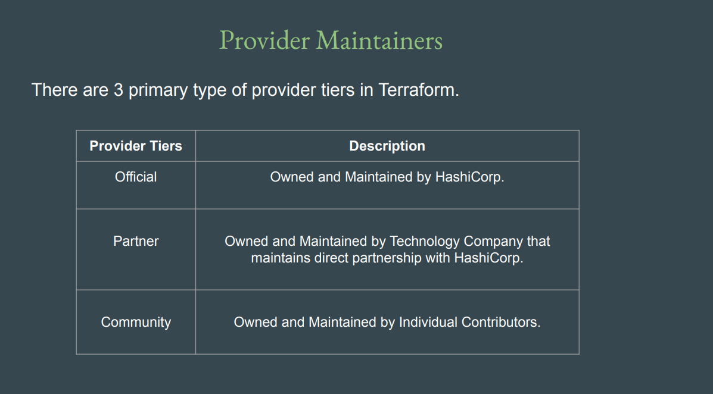
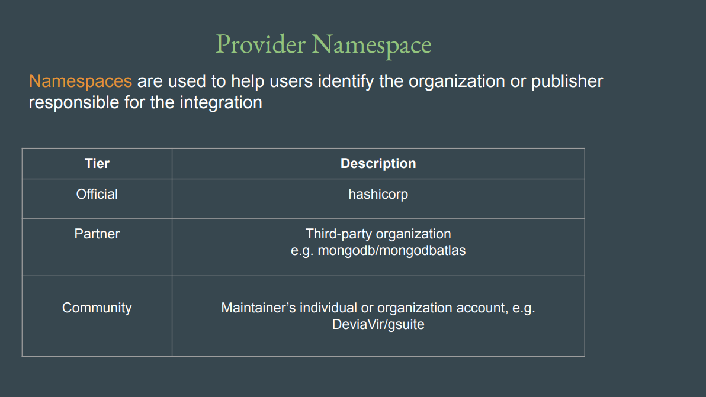
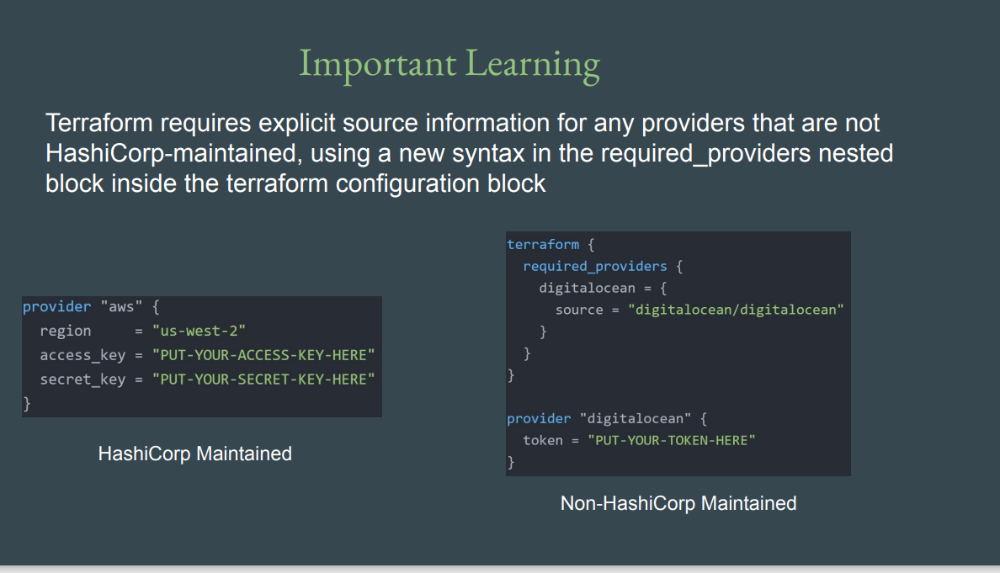
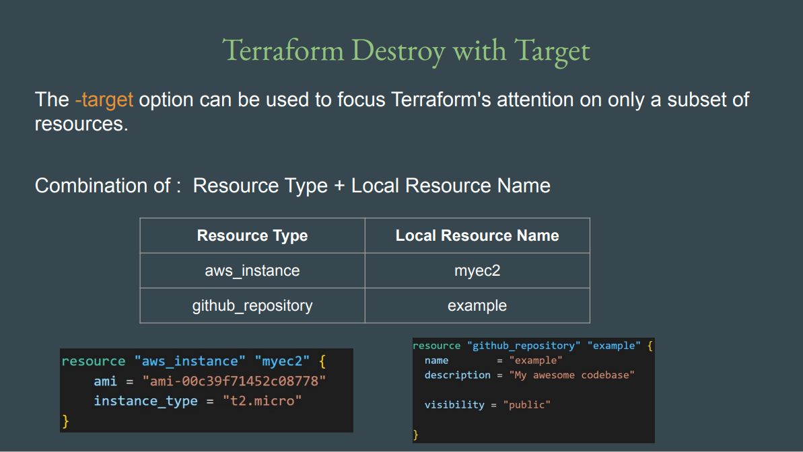
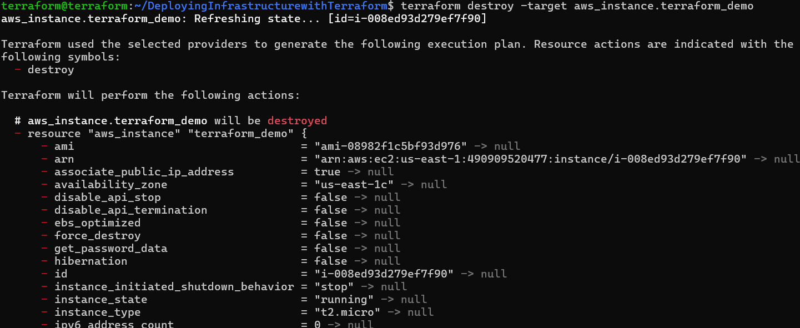
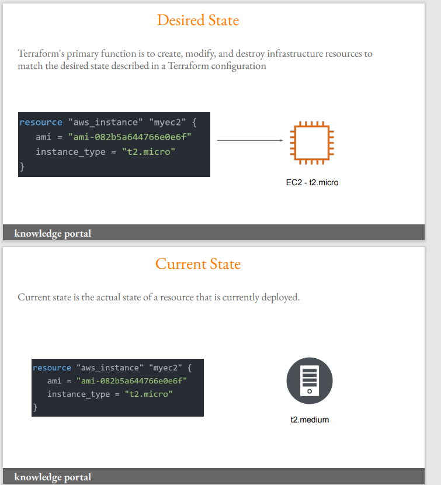
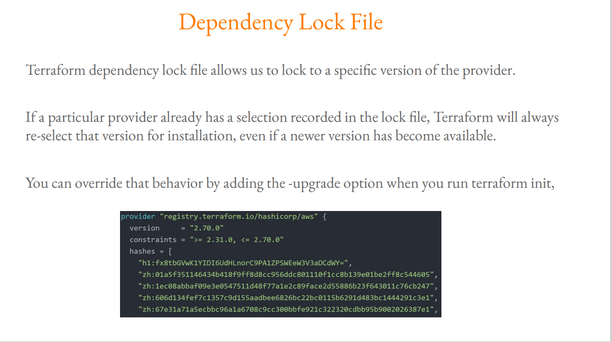
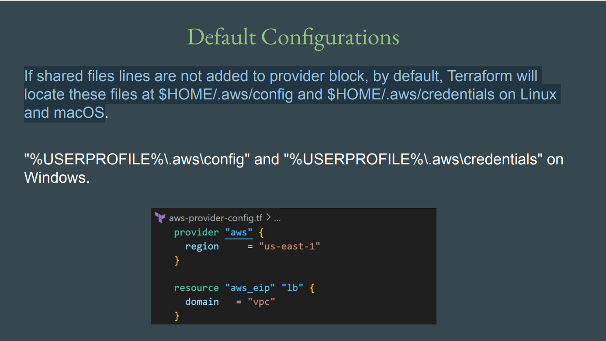

# Deploying Infrastructure with Terraform

- While creating VM through Terraform, you will need to define these.

   - Available Regions : 
   - Virtual Machine Configuration : 
     A Virtual Machine would have it’s own set of configurations.
     - CPU
     - Memory
     - Storage
     -  Operating System

## Terraform Core Commands

Terraform uses a workflow to manage infrastructure as code.  
The three most important commands are **`init`**, **`plan`**, and **`apply`**.  

---

### 1. `terraform init`

#### 📌 Description
Initializes a new or existing Terraform working directory.

#### 🔧 What it does
- Downloads and installs **provider plugins** (e.g., AWS, Azure, GCP).
- Configures the **backend** for storing the Terraform state (local or remote).
- Prepares and downloads any defined **modules**.
- Sets up the working directory for further Terraform commands.

#### 🗓 When to use
- First time you create a Terraform project.
- After adding or modifying providers or modules.
- After cloning a repository with Terraform code.

#### 🖥 Example
```bash
terraform init
```
#### When `terraform init` is Required Again

   You need to run `terraform init` again in the following cases:

- **Changing the provider**  
  Example: Switching from AWS to Azure.

- **Upgrading the provider version**  
  Example: Updating AWS provider from version 5.0 → 6.0.

- **Moving the project to a new folder or system**  
  Reason: The `.terraform` directory, which contains cached provider plugins, will not exist. In these cases, Terraform needs to download or reconfigure the provider plugin again.

### 2. `terraform plan`

#### 📌 Description
Generates and shows an execution plan, describing the changes Terraform will make to reach the desired state.

#### 🔧 What it does
- Reads the **current state** (from the `.tfstate` file).
- Compares it with the configuration in `.tf` files.
- Displays the actions to be performed:
  - `+` Create new resource  
  - `~` Modify existing resource  
  - `-` Destroy resource  
- Does **not** actually apply changes — it’s only a preview.

#### 🗓 When to use
- Before running `terraform apply` to review upcoming changes.
- To validate that your configuration works as expected.
- To safely check for **infrastructure drift**.

#### 🖥 Example
```bash
terraform plan
```
### 3. `terraform apply`

#### 📌 Description
Applies the changes required to reach the desired state of the configuration.

#### 🔧 What it does
- Executes the actions shown in the plan.
- Creates, updates, or deletes resources as defined in `.tf` files.
- Updates the **terraform.tfstate** file to reflect the actual infrastructure.
- Can be run with `-auto-approve` to skip manual approval.

#### 🗓 When to use
- After reviewing the execution plan and confirming it is correct.
- To provision or update infrastructure.

#### 🖥 Example
```bash
terraform apply
```

#### or (skip confirmation):
```bash
terraform apply -auto-approve
```


## Terraform Concepts: Provider and Resource

Terraform is an Infrastructure as Code (IaC) tool that allows you to define and manage infrastructure using configuration files. Two fundamental concepts in Terraform are **Provider** and **Resource**.

---

### 1. Provider

#### Definition
A **Provider** is a plugin in Terraform that allows it to interact with cloud platforms, services, or APIs. Providers are responsible for managing the lifecycle of resources by translating Terraform configurations into API calls.

#### Key Points
- Providers are specific to the platform or service (e.g., AWS, Azure, Google Cloud, Kubernetes).
- Each provider requires configuration (like credentials, region, subscription ID, etc.).
- Without a provider, Terraform cannot create or manage resources for that service.

#### Example (AWS Provider)
```hcl
provider "aws" {
  region     = "us-east-1"
  access_key = "YOUR_ACCESS_KEY"
  secret_key = "YOUR_SECRET_KEY"
}
```
### 2. Resource

#### Definition
A **Resource** in Terraform represents a component of your infrastructure that you want to create, manage, or update. Resources correspond to real-world objects like virtual machines, storage accounts, databases, or networking components.

#### Key Points
- Resources are the building blocks of your Terraform configuration.
- Each resource belongs to a provider and has a **type** and a **name**.
- Terraform keeps track of resources in its state file to manage lifecycle operations like creation, updates, and deletions.
- Resources can have arguments (properties) and optional nested blocks (like tags or network configurations).

#### Example (AWS EC2 Instance Resource)
```hcl
resource "aws_instance" "example" {
  ami           = "ami-0c55b159cbfafe1f0"
  instance_type = "t2.micro"

  tags = {
    Name = "ExampleInstance"
  }
}
```

 
 
 

### Terraform `destroy` Command

The `terraform destroy` command is used to **delete all or specific infrastructure resources** that were created and managed by Terraform. It essentially reverses the `terraform apply` operation.

---

#### 1. Purpose

- Remove all resources defined in the Terraform configuration.
- Useful for cleaning up resources to avoid unnecessary costs.
- Ensures that infrastructure is deleted in a controlled and predictable manner.

---

#### 2. Key Points

- Terraform uses the **state file** to track all resources it manages.
- `terraform destroy` reads the state file and calls the provider APIs to delete resources.
- It is **destructive**, so it should be used with caution.
- Can destroy **all resources** or **specific resources** using the `-target` option.


```bash
   terraform destroy -target resourc type.local resource name
```

---

#### 3. Basic Usage

Destroy all resources managed by Terraform:
resources that are part of the folder from which the command has run will be destroyed.

```bash
terraform destroy
**second method is comment out resource code in tf file and apply** 
```
  
  

### Terraform State files

  - whenever you create a resource,Terraform behind the scenes,it also stores the information associated with this resource in a file called as Terraform state file

 - if we  destroy resource than also state file data will be remove 


###  Desired & Current States
 
 - Terraform tries to ensure that the deployed infrastructure is based on the desired state.
 - If there is a difference between the two, terraform plan presents a description of the 
changes necessary to achieve the desired state


### Terraform Provider Versioning

- During terraform init, if version argument is not specified, the most recent provider will be 
downloaded during initialization.

- For production use, you should constrain the acceptable provider versions via configuration, to 
ensure that new versions with breaking changes will not be automatically installed.


#### Terraform `init -upgrade` Command

The `terraform init -upgrade` command is a variant of the standard `terraform init` command. It is used to **upgrade the provider plugins** used by Terraform to the newest acceptable versions according to your configuration.

---

##### 1. Purpose

- **Upgrade provider plugins** to the latest version that matches your version constraints.
- Useful when your configuration specifies a **version range** for a provider and a newer version is available.
- Ensures Terraform uses the **most recent stable provider**, which may include bug fixes or new features.

---

#### 2. Key Points

- Works only with **provider plugins**, not Terraform itself.
- Does **not** modify your configuration; it only upgrades the downloaded plugins.
- Safe to run even if your project is already initialized.
- Helps when you want to stay up-to-date with provider releases.

---

#### 3. Usage

```bash
terraform init -upgrade
```

### Terraform Refresh

#### Terraform `apply -refresh-only -auto-approve`

This command is used to **update Terraform's state file** without making any changes to the actual infrastructure.

---

##### 1. Purpose

- **`-refresh-only`**:  
  - Updates the Terraform **state file** to match the real-world infrastructure.  
  - Does **not create, modify, or delete any resources**.  
  - Useful when something was changed **outside Terraform** (manual changes or drift).

- **`-auto-approve`**:  
  - Skips the confirmation prompt.  
  - Terraform will refresh the state automatically without asking you `yes` or `no`.

---

##### 2. Example Use Case

Suppose someone manually changed an EC2 instance type in AWS.  
- Terraform's state file is now **out of sync** with the actual resource.  
- Running:

```bash
terraform apply -refresh-only -auto-approve
```

### AWS Provider - Authentication Configuration




  

- if we change resource configuration manually in aws then we apply configue file that change resurce as per configueration file and also change in state tf 

- if we run aplly -refresh-only than the  only change state file not in resource

- if we delete state file then they create new resources

- and if we delete state file and use refresh-only command that is not give any data on file 


