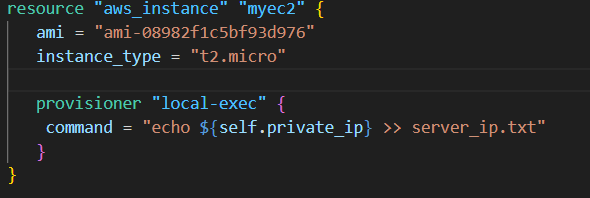
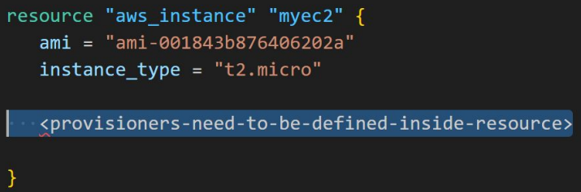
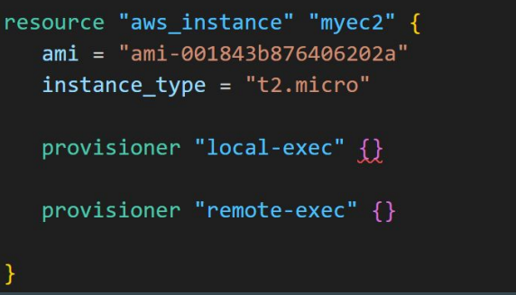
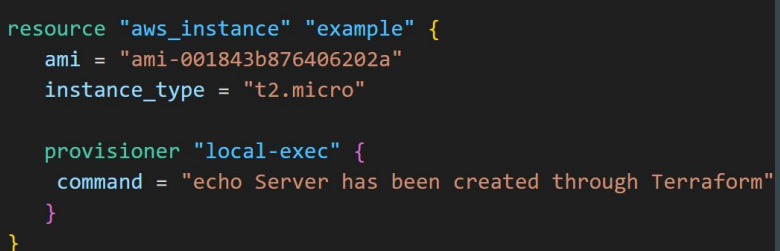
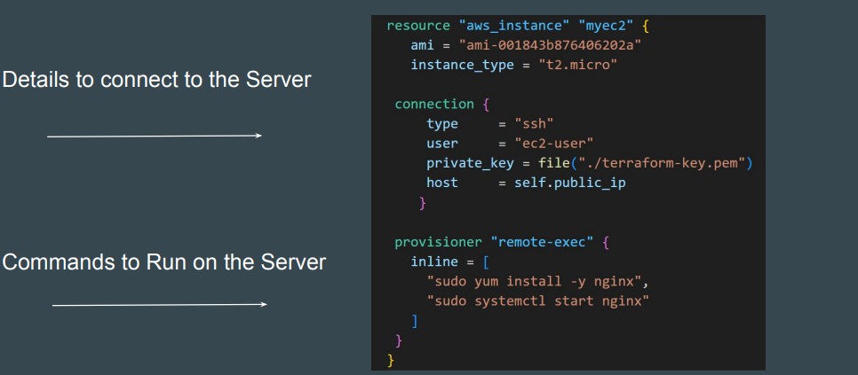
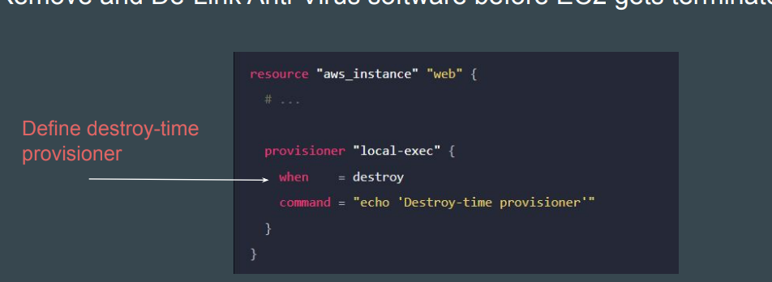
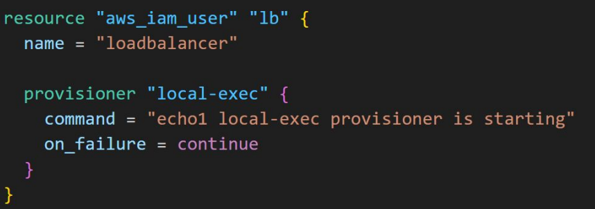

#  Terraform Provisioners

- Provisioners are used to execute scripts on a local or remote machine as part of 
resource creation or destruction.
  - Example: After VM is launched, install software package required for application.

## types of  Provisioners

#### Type 1 - local-exec provisioner
- Local-exec allows to run some command in the local machine where Terraform is running.
  - Example: After EC2 is launched, fetch the IP and store it in file server_ip.txt
  - self refers to the resource to which this is associated with.For example, since this self is under the resource of aws_instance.myec2, it references to that.to which this is associated with.For example, since this self is under the resource of aws_instance.myec2, it references to that.

  

####  Type 2 - remote-exec provisioner

- Remote-exec allows you to run some command in the remote server of your choosing.

  - Example: After EC2 is launched, install “apache” software
    
    

#### Format of Provisioners

  1. Provisioners are defined inside a specific resource.
    

  2. Provisioners are defined by “provisioner” followed by type of provisioner
     

  3. For local provisioners, we have to specify command that needs to be run locally 
       

  4. ince commands are executed on remote-server, we have to provide way for Terraform to connect to remote server   
      

###  Creation-Time & Destroy-Time Provisioners

 #### Creation-Time Provisioners
 - Creation-time provisioners are only run during creation, not during updating or any other lifecycle.

 ####  Destroy-Time Provisioner

 - Destroy provisioners are run before the resource is destroyed.
     - Example: Remove and De-Link Anti-Virus software before EC2 gets terminated.

       

####   Failure Behaviour for Provisioners

- By default, provisioners that fail will also cause the terraform apply itself to fail.

- This will lead to resource being tainted and we have to re-create the resource.

- The on_failure setting can be used to change the default behaviour. by default  is fail

| Allowed Values | Description |
| :--- | :--- |
| **continue** | Ignore the error and continue with creation or destruction. |
| **fail** | Raise an error and stop applying (the default behavior). If this is a creation provisioner, taint the resource. |

