# Read, Generate, Modify Congiruations

- Cross Referencing Resource Attribute
  - when we create resouces that time depencincy with one resources to another resource that time use 
     - However Resource 2 might be dependent on some value of Resource 1.
     1. Analyzing the Attributes of resource
     2. Referencing Attribute in Other Resource
       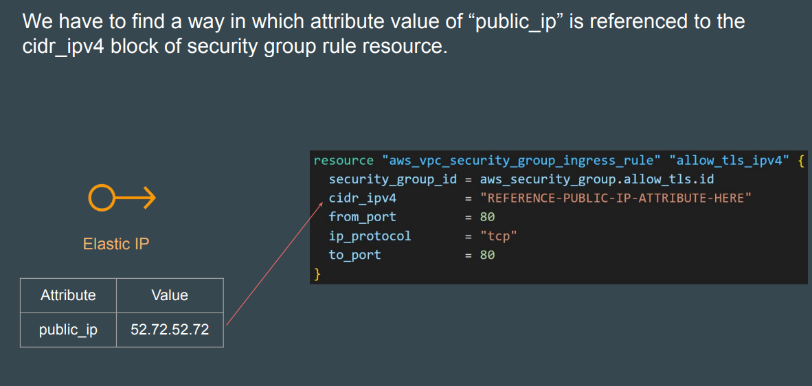
        - Terraform allows us to reference the attribute of one resource to be used in a different resource.
     
      Overall syntax:
     ```bash 
      <RESOURCE TYPE>.<NAME>.<ATTRIBUTE>
      ```
       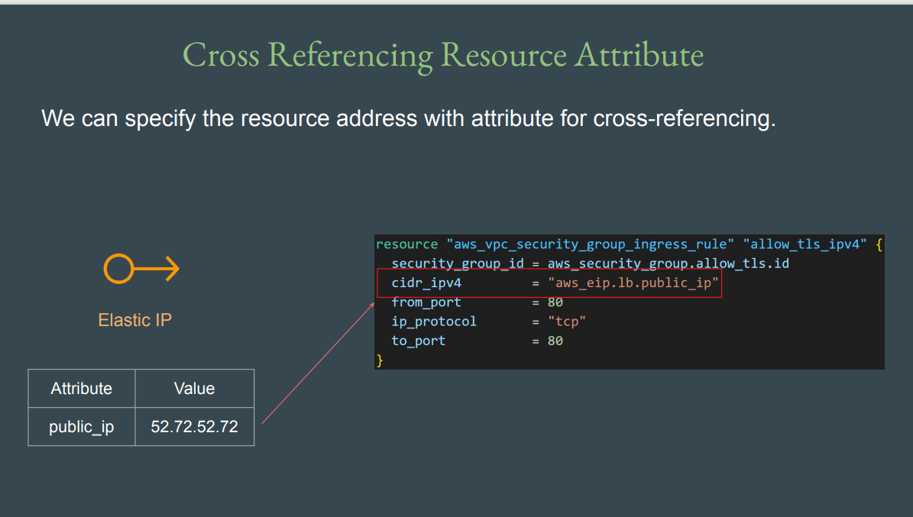

       ```bash
          aws_security_group.allow_tls.id
          resource type.resource local name.attributes 
       ```


 ### String Interpolation in Terraform

   - ${...}): This syntax indicates that Terraform will replace the expression inside the 
curly braces with its calculated value
     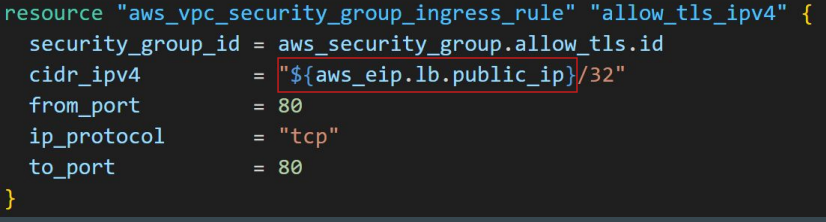
      


### variable

- terraform input variables are used to pass certain values from outside of the configuration.
(repetate values like vm ip use in mutliple place )

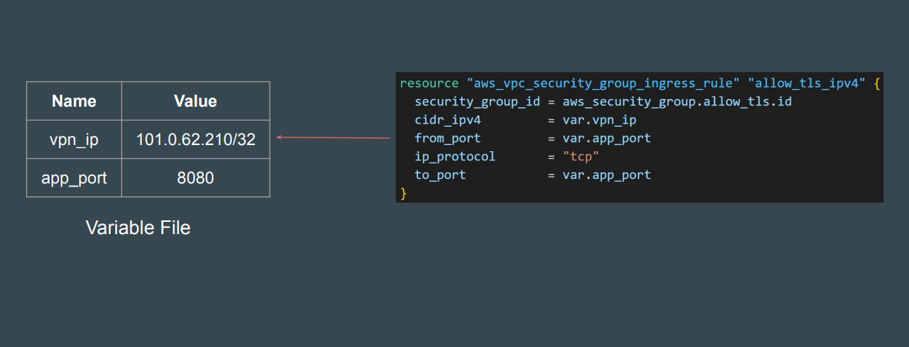


### Variable Definitions file (TFVARS)

- The term tfvars is shorthand for Terraform Variables, and it refers to a file that contains values for input variables defined in your Terraform configuration.

- It's the standard, dedicated mechanism used to pass dynamic data and environment-specific settings into your Infrastructure as Code (IaC) templates.

-A .tfvars file is correctly called a "file of variable values" or a "variable definition file."

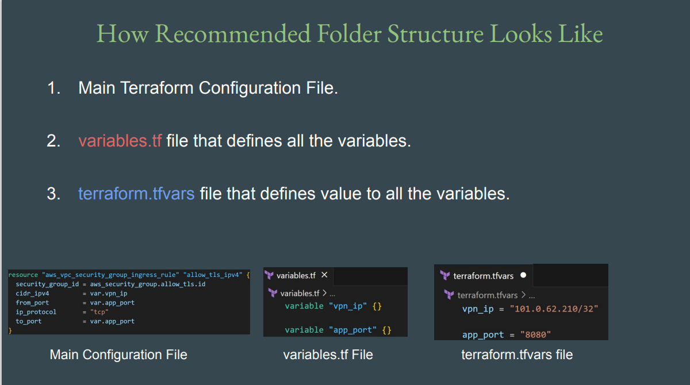
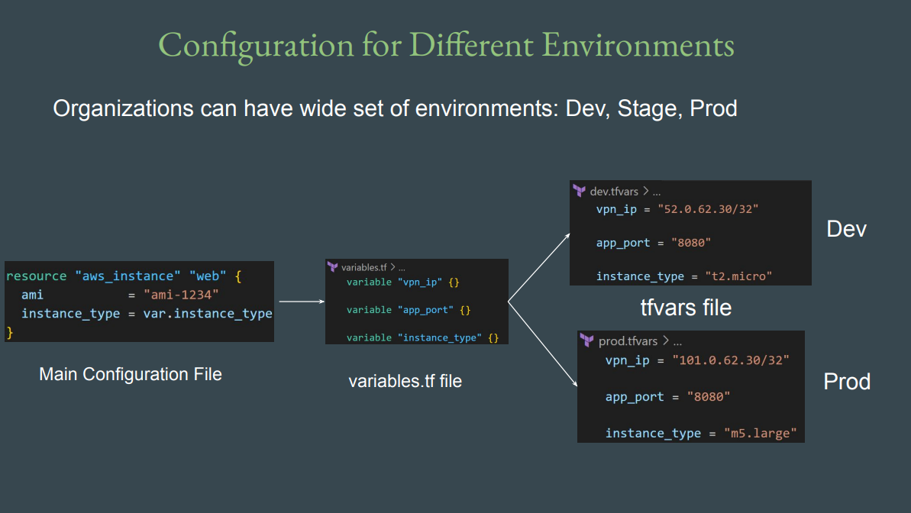

- If file name is terraform.tfvars → Terraform will automatically load values from it.
- If file name is different like prod.tfvars → You have to explicitly define the file 
during plan / apply operation.
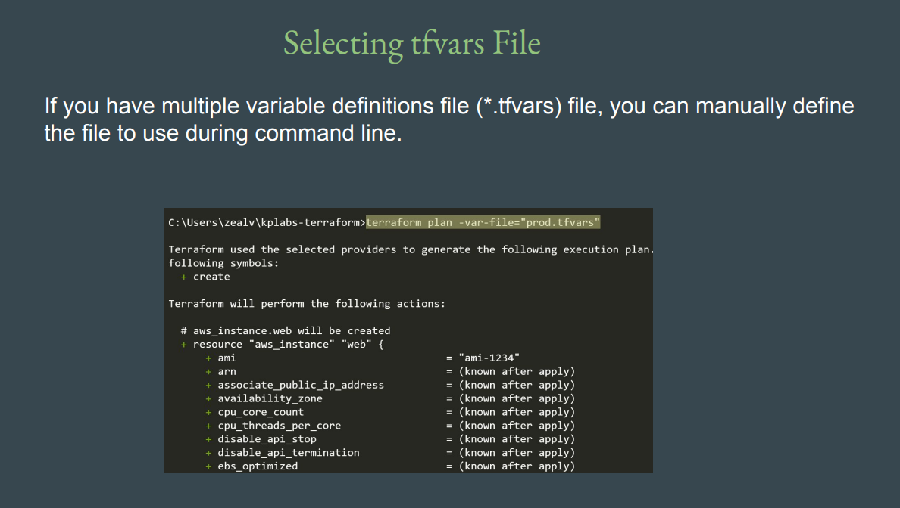


- if we give default value in variable file and there is no value for that variable in tfvars file than terraform pick value from variable file 


- if we give default value in variable file and also give values for that variable in tfvars file than terraform pick value from tfvars  file 


###  Approach to Variable Assignment

- When variables are declared in your configuration, they can be set in a number 
of ways:
1. Variable Defaults.
2. Variable Definition File (*.tfvars)
3. Environment Variables
4. Setting Variables in the Command Line.

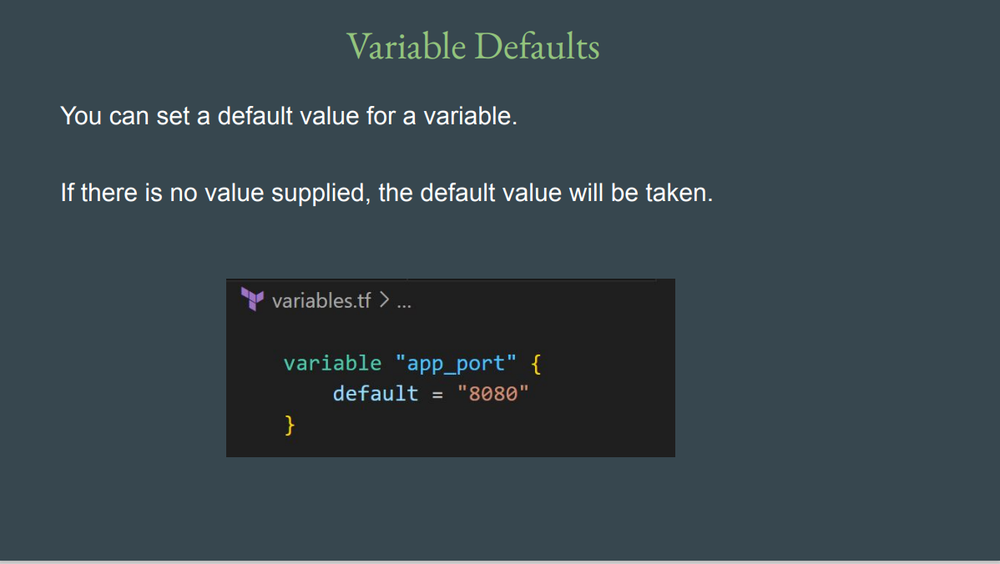
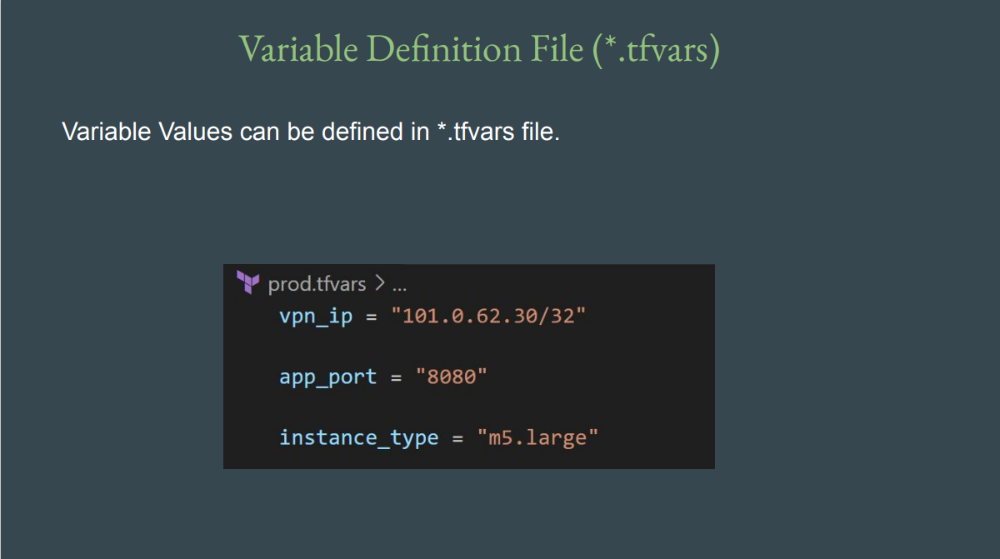
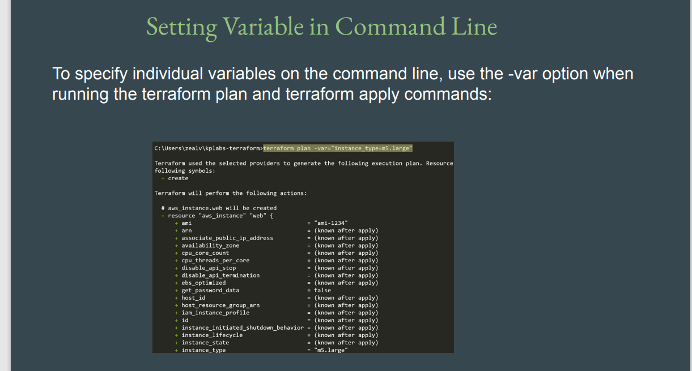
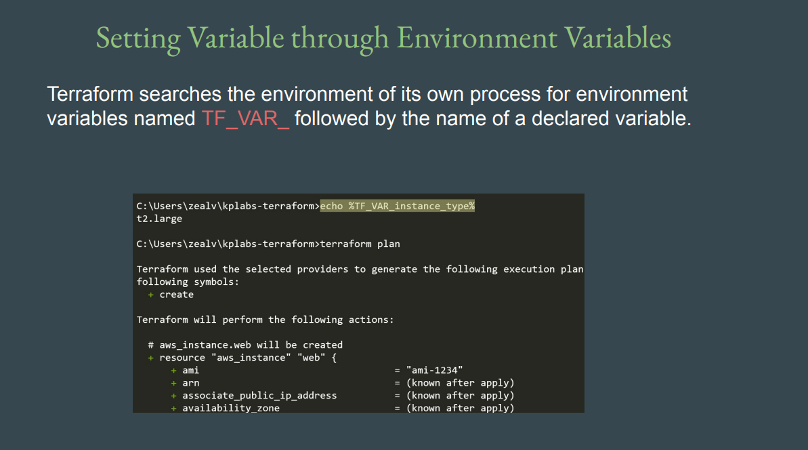


### Loading Variable Values from CLI
```bash
terraform plan -var="instancetype=t2.small"
```
### Loading from custom tfvars file
```bash
terraform plan -var-file="custom.tfvars"
```
### Linux / MAC specific commands
```bash
export TF_VAR_instancetype=t2.nano
echo TF_VAR_instancetype
```

- When run without any arguments, printenv displays a list of every environment variable and its assigned value. This is useful for seeing the entire context of your shell.

```bash
 printenv
```

### Setting Environment Variable in Linux
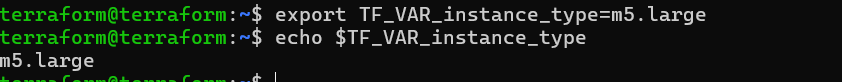

###  Variable Definition Precedence
#### Here is the order of precedence, from highest (used first) to lowest (used last):
1. -var and -var-file flags (What you provided: iam-234)

2. Environment Variables (e.g., TF_VAR_iam=234)

3. Automatic .tfvars files (terraform.tfvars, *.auto.tfvars)

4. default value in variables.tf (What you set: 123)

### Data Types

- Data type refers to the type of value.
  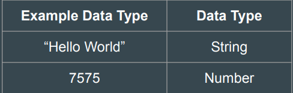

  - We can restrict the value of a variable to a data type.
        
      - Example: Only numbers should be allowed in AWS Usernames.


  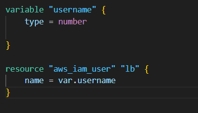

  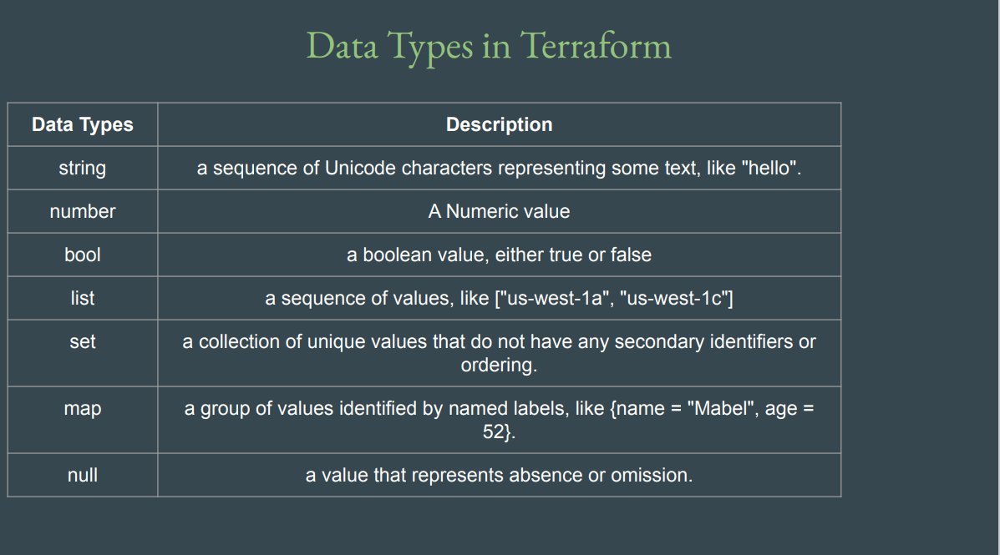


  #### Data Type - List

- Allows us to store collection of values for a single variable / argument.
- Represented by a pair of square brackets containing a comma-separated sequence of values, like ["a", 15, true].

****
  - value must be in []

- Create EC2 instance with 2 security groups attached.
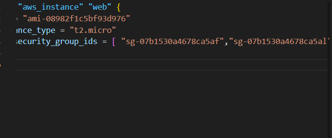
- We can also specify the type of values expected in a list.

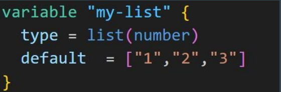


#### Data Type - Map
- A map data type represents a collection of key-value pair elements

***
#### Fetching Data from Maps and List in Variable

- if we want to fetch data from map needs to mention specific key name 
  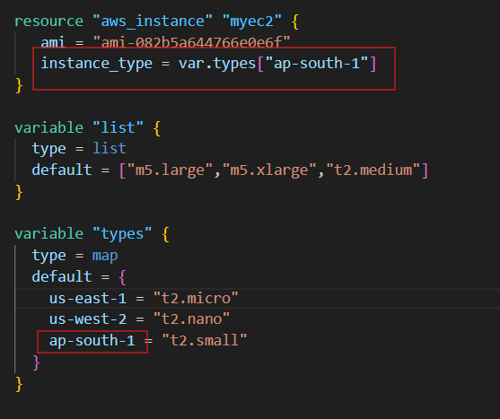
  
- if we want to fetch data from list needs to mention position of value 
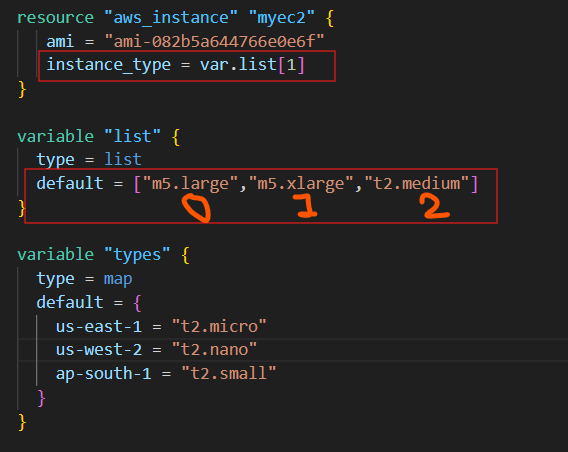
***

#### The Count Meta-Argument

- The count argument accepts a whole number, and creates that many instances 
of the resource.

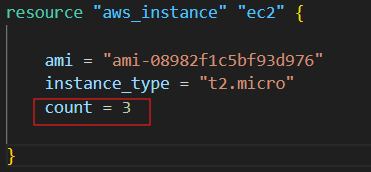
 
   ##### count index

   - if we want give differant name than we can use count.index and indexing start with 0 and count.index give only number  
  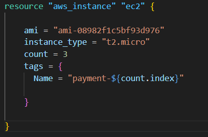

  - if we want to give differant name than we can use variable as showing below

       - if we give count value as 2 than the create user like a and b not c
   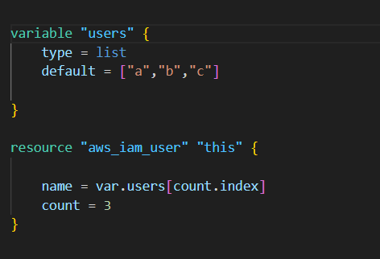

### Conditional Expressions

- Conditional expressions in Terraform allow you to choose between two values 
based on a condition

 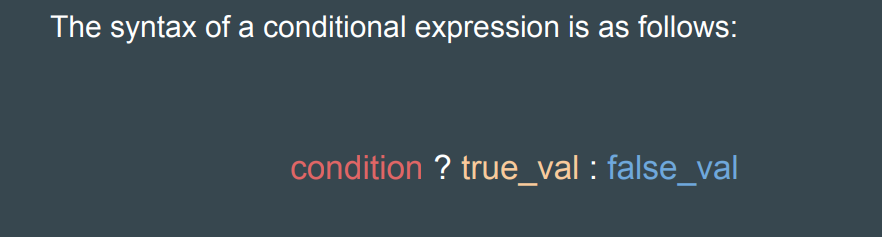
