# Read, Generate, Modify Congiruations

- Cross Referencing Resource Attribute
  - when we create resouces that time depencincy with one resources to another resource that time use 
     - However Resource 2 might be dependent on some value of Resource 1.
     1. Analyzing the Attributes of resource
     2. Referencing Attribute in Other Resource
       
        - Terraform allows us to reference the attribute of one resource to be used in a different resource.
     
      Overall syntax:
     ```bash 
      <RESOURCE TYPE>.<NAME>.<ATTRIBUTE>
      ```
       

       ```bash
          aws_security_group.allow_tls.id
          resource type.resource local name.attributes 
       ```


 ### String Interpolation in Terraform

   - ${...}): This syntax indicates that Terraform will replace the expression inside the 
curly braces with its calculated value
     
      


### variable

- terraform input variables are used to pass certain values from outside of the configuration.
(repetate values like vm ip use in mutliple place )


### Variable Definitions file (TFVARS)

- The term tfvars is shorthand for Terraform Variables, and it refers to a file that contains values for input variables defined in your Terraform configuration.

- It's the standard, dedicated mechanism used to pass dynamic data and environment-specific settings into your Infrastructure as Code (IaC) templates.

-A .tfvars file is correctly called a "file of variable values" or a "variable definition file."


- If file name is terraform.tfvars → Terraform will automatically load values from it.
- If file name is different like prod.tfvars → You have to explicitly define the file 
during plan / apply operation.


- if we give default value in variable file and there is no value for that variable in tfvars file than terraform pick value from variable file 


- if we give default value in variable file and also give values for that variable in tfvars file than terraform pick value from tfvars  file 


###  Approach to Variable Assignment

- When variables are declared in your configuration, they can be set in a number 
of ways:
1. Variable Defaults.
2. Variable Definition File (*.tfvars)
3. Environment Variables
4. Setting Variables in the Command Line.


### Loading Variable Values from CLI
```bash
terraform plan -var="instancetype=t2.small"
```
### Loading from custom tfvars file
```bash
terraform plan -var-file="custom.tfvars"
```
### Linux / MAC specific commands
```bash
export TF_VAR_instancetype=t2.nano
echo TF_VAR_instancetype

for more than one function we can create file and give in to the command
export TF_VAR_PATH=file path
```

- When run without any arguments, printenv displays a list of every environment variable and its assigned value. This is useful for seeing the entire context of your shell.

```bash
 printenv
```

### Setting Environment Variable in Linux


###  Variable Definition Precedence
#### Here is the order of precedence, from highest (used first) to lowest (used last):
1. -var and -var-file flags (What you provided: iam-234)

2. Environment Variables (e.g., TF_VAR_iam=234)

3. Automatic .tfvars files (terraform.tfvars, *.auto.tfvars)

4. default value in variables.tf (What you set: 123)

### Data Types

- Data type refers to the type of value.
  

  - We can restrict the value of a variable to a data type.
        
      - Example: Only numbers should be allowed in AWS Usernames.


  

  


  #### Data Type - List

- Allows us to store collection of values for a single variable / argument.
- Represented by a pair of square brackets containing a comma-separated sequence of values, like ["a", 15, true].

****
  - value must be in []

- Create EC2 instance with 2 security groups attached.

- We can also specify the type of values expected in a list.


#### Data Type - Map
- A map data type represents a collection of key-value pair elements

***
#### Fetching Data from Maps and List in Variable

- if we want to fetch data from map needs to mention specific key name 
  
  
- if we want to fetch data from list needs to mention position of value 

***

#### The Count Meta-Argument

- The count argument accepts a whole number, and creates that many instances 
of the resource.


 
   ##### count index

   - if we want give differant name than we can use count.index and indexing start with 0 and count.index give only number  
  

  - if we want to give differant name than we can use variable as showing below

    - if we give count value as 2 than the create user like a and b not c
   

### Conditional Expressions

- Conditional expressions in Terraform allow you to choose between two values 
based on a condition

 


### Terraform Functions ([link](https://developer.hashicorp.com/terraform/language/functions/floor))
- A function is a block of code that performs a specific task.
- Terraform Console provides an interactive environment specifically designed to test functions and experiment with expressions before integrating them into your main code.

  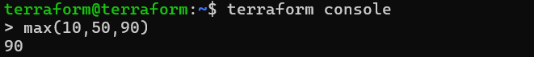

- show file content of given file along with path
  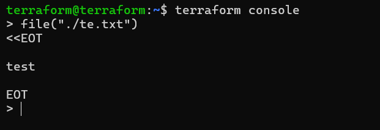

-  for example giving all policy data into tf file we use file function and put all policy content into seprate file and give file name along with path in to file function that fatch all policy data into tf file

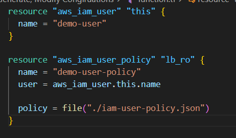


#### lookup 
- lookup retrieves the value of a single element from a map, given its key. If the given key does not exist, the given default value is returned instead.
- example
  ```bash
  lookup (map,key,default)

   lookup({a="ay", b="bee"}, "a", "what?")
   ay
   lookup({a="ay", b="bee"}, "c", "what?")
   what?

   lookup({"us-east-1" = "ami-08a0d1e16fc3f61ea","us-west-2" = "ami-0b20a6f09484773af","ap-south-1" = "ami-0e1d06225679bc1c5"},"us-east-1")

    # give output as "ami-08a0d1e16fc3f61ea" as we give key as "us-east-1"
   # if  we give key as "us-west-2" then the output will be "ami-0b20a6f09484773af"
    ```

 #### length 
 - length determines the length of a given list,map,or string

 - example  

 ```bash
> length([])
0
> length(["a", "b"])
2
> length({"a" = "b"})
1
> length("hello")
5
 ```  
#### element
- element retrieves a single element from a list.
- example
```bash
element(list, index)

element(["a", "b", "c"], 1)
"b"
```

#### timestamp and formatdate
- timestamp returns a UTC timestamp string in RFC 3339 format.
- formatdate can convert the resulting timestamp to other date and time formats.

```bash
> timestamp()
2018-05-13T07:44:12Z


formatdate(spec, timestamp)
> formatdate("DD MMM YYYY hh:mm ZZZ", "2018-01-02T23:12:01Z")
02 Jan 2018 23:12 UTC
> formatdate("EEEE, DD-MMM-YY hh:mm:ss ZZZ", "2018-01-02T23:12:01Z")
Tuesday, 02-Jan-18 23:12:01 UTC
> formatdate("EEE, DD MMM YYYY hh:mm:ss ZZZ", "2018-01-02T23:12:01-08:00")
Tue, 02 Jan 2018 23:12:01 -0800
> formatdate("MMM DD, YYYY", "2018-01-02T23:12:01Z")
Jan 02, 2018
> formatdate("HH:mmaa", "2018-01-02T23:12:01Z")
11:12pm
```

### Local Values 

- Local Values are similar to Variables in a sense that it allows you to store data 
centrally and that can be referenced in multiple parts of configuration.
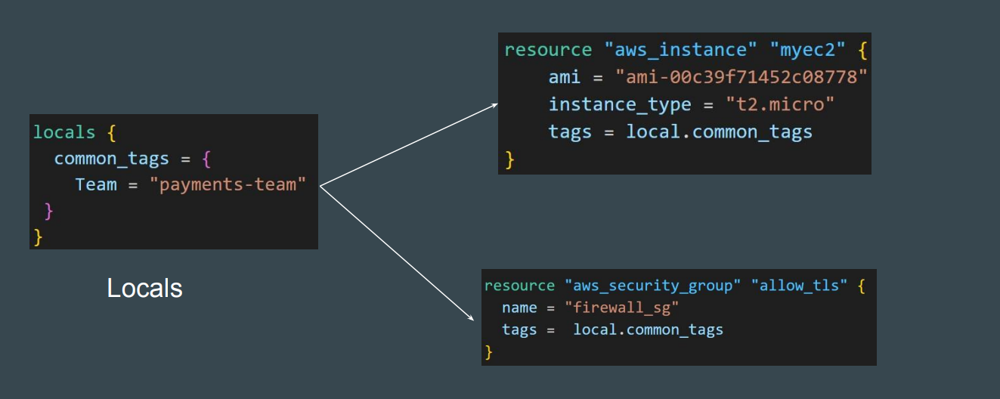

-  Additional Benefit of Locals: You can add expressions to locals, which allows you to compute values dynamically or also call function 

- Local values are created by a locals block (plural), but you reference them as attributes on an object named local (singular)
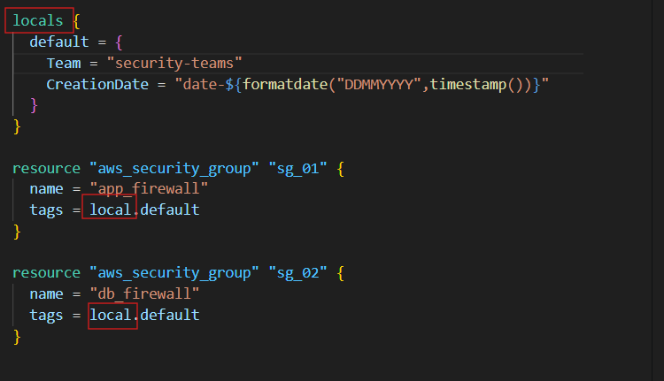

### Data Sources

- Data sources allow Terraform to use / fetch information defined outside of Terraform
  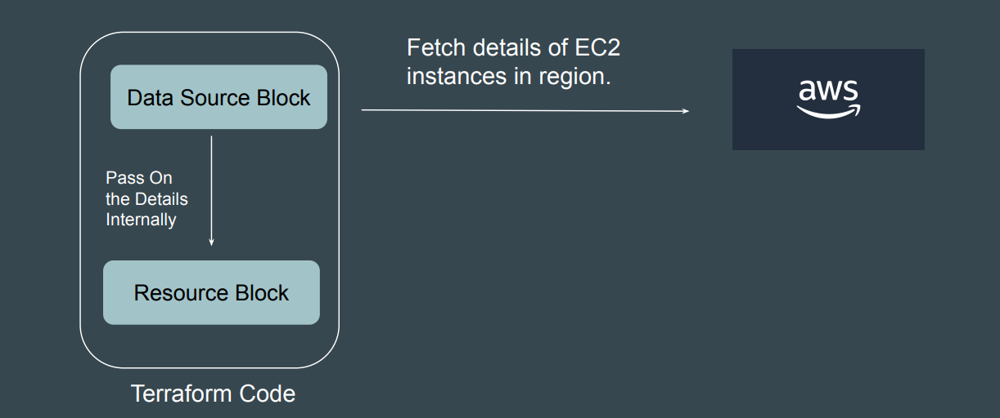
  - ${path.module} returns the current file system path where your code is located.


### Terraform Logs
```bash
- set Log verbosity = TF_LOG
- set to store logs = TF_LOG_PATH
```
- Terraform has detailed logs that you can enable by setting the TF_LOG environment variable to any value.
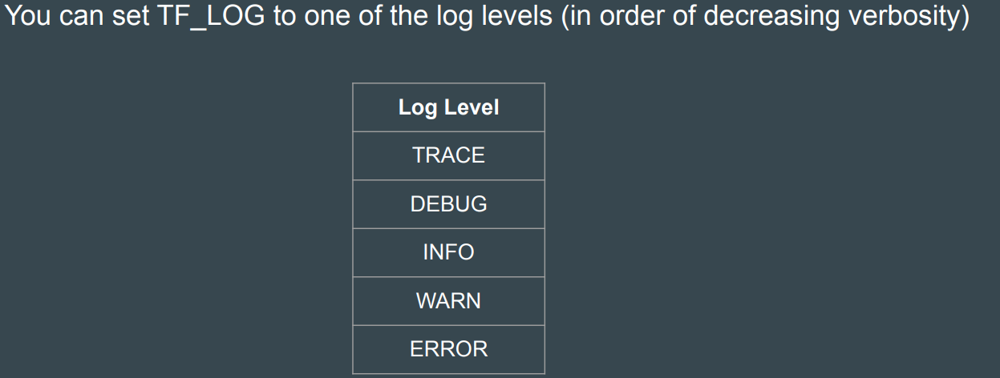
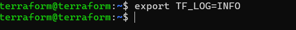
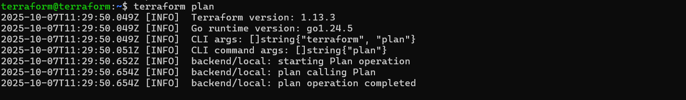
- To persist logged output you can set TF_LOG_PATH in order to force the log to always be appended to a specific file when logging is enabled
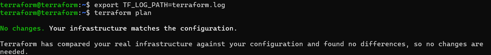
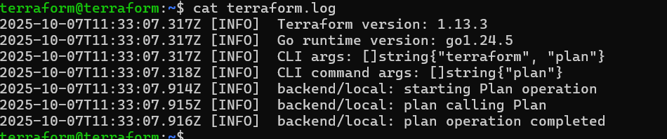


### Terraform Format

- The terraform fmt command is used to rewrite Terraform configuration files to take care of the overall formatting. 

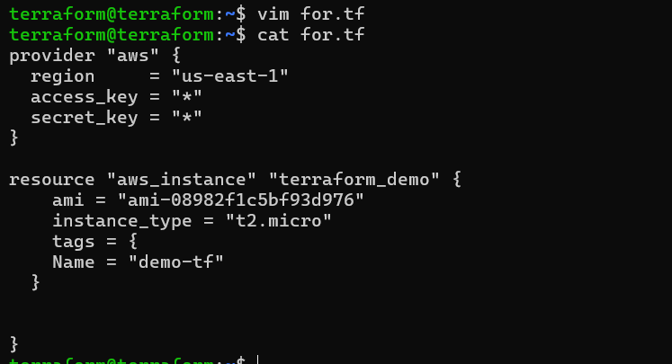
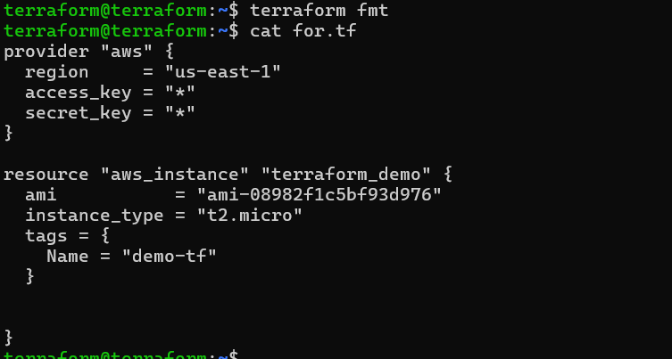

### Dynamic Blocks
- Dynamic Block allows us to dynamically construct repeatable nested blocks which is supported inside resource, data, provider, and provisioner blocks:


### Terraform validate 

- Terraform Validate primarily checks whether a configuration is syntactically valid. 

- It can check various aspects including unsupported arguments, undeclared variables and others.

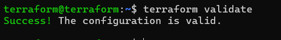
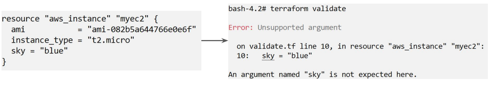


### Tainting Resources
- The terraform taint command is used to manually mark a resource in the Terraform state file as needing to be replaced.

- This action forces Terraform to consider the resource to be corrupted or unusable. On the next terraform apply, Terraform will generate a plan to destroy the old, tainted resource and create an entirely new one, even if the configuration code hasn't changed.

- It's primarily used for recovery when a cloud resource has failed or been manually damaged outside of Terraform's control.

```bash
terraform apply -replace="aws_instance.myec2"
                          # resource.rsource local name
```
 
 
