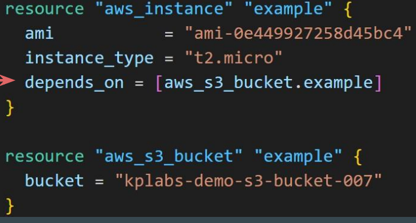

# Read, Generate, Modify Congiruations

- Cross Referencing Resource Attribute
  - when we create resouces that time depencincy with one resources to another resource that time use 
     - However Resource 2 might be dependent on some value of Resource 1.
     1. Analyzing the Attributes of resource
     2. Referencing Attribute in Other Resource
       
        - Terraform allows us to reference the attribute of one resource to be used in a different resource.
     
      Overall syntax:
     ```bash 
      <RESOURCE TYPE>.<NAME>.<ATTRIBUTE>
      ```
       

       ```bash
          aws_security_group.allow_tls.id
          resource type.resource local name.attributes 
       ```


 ### String Interpolation in Terraform

   - ${...}): This syntax indicates that Terraform will replace the expression inside the 
curly braces with its calculated value
     
      


### variable

- terraform input variables are used to pass certain values from outside of the configuration.
(repetate values like vm ip use in mutliple place )


### Variable Definitions file (TFVARS)

- The term tfvars is shorthand for Terraform Variables, and it refers to a file that contains values for input variables defined in your Terraform configuration.

- It's the standard, dedicated mechanism used to pass dynamic data and environment-specific settings into your Infrastructure as Code (IaC) templates.

-A .tfvars file is correctly called a "file of variable values" or a "variable definition file."


- If file name is terraform.tfvars → Terraform will automatically load values from it.
- If file name is different like prod.tfvars → You have to explicitly define the file 
during plan / apply operation.


- if we give default value in variable file and there is no value for that variable in tfvars file than terraform pick value from variable file 


- if we give default value in variable file and also give values for that variable in tfvars file than terraform pick value from tfvars  file 


###  Approach to Variable Assignment

- When variables are declared in your configuration, they can be set in a number 
of ways:
1. Variable Defaults.
2. Variable Definition File (*.tfvars)
3. Environment Variables
4. Setting Variables in the Command Line.


### Loading Variable Values from CLI
```bash
terraform plan -var="instancetype=t2.small"
```
### Loading from custom tfvars file
```bash
terraform plan -var-file="custom.tfvars"
```
### Linux / MAC specific commands
```bash
export TF_VAR_instancetype=t2.nano
echo TF_VAR_instancetype

for more than one function we can create file and give in to the command
export TF_VAR_PATH=file path
```

- When run without any arguments, printenv displays a list of every environment variable and its assigned value. This is useful for seeing the entire context of your shell.

```bash
 printenv
```

### Setting Environment Variable in Linux


###  Variable Definition Precedence
#### Here is the order of precedence, from highest (used first) to lowest (used last):
1. -var and -var-file flags (What you provided: iam-234)

2. Environment Variables (e.g., TF_VAR_iam=234)

3. Automatic .tfvars files (terraform.tfvars, *.auto.tfvars)

4. default value in variables.tf (What you set: 123)

### Data Types

- Data type refers to the type of value.
  

  - We can restrict the value of a variable to a data type.
        
      - Example: Only numbers should be allowed in AWS Usernames.


  

  


  #### Data Type - List

- Allows us to store collection of values for a single variable / argument.
- Represented by a pair of square brackets containing a comma-separated sequence of values, like ["a", 15, true].

****
  - value must be in []

- Create EC2 instance with 2 security groups attached.

- We can also specify the type of values expected in a list.


#### Data Type - Map
- A map data type represents a collection of key-value pair elements


#### Data Type - SET 
- Sets can only store unique elements.
- Any duplicates are automatically removed
- A set does not store the order of the elements.
- Terraform only tracks the presence of elements, not their order
- If the elements in a set change order, Terraform won’t detect that as a change. However, if an element is added or removed, Terraform will apply updates accordingly.


***
#### Fetching Data from Maps and List in Variable

- if we want to fetch data from map needs to mention specific key name 
  
  
- if we want to fetch data from list needs to mention position of value 

***

#### The Count Meta-Argument

- The count argument accepts a whole number, and creates that many instances 
of the resource.


 
   ##### count index

   - if we want give differant name than we can use count.index and indexing start with 0 and count.index give only number  
  

  - if we want to give differant name than we can use variable as showing below

    - if we give count value as 2 than the create user like a and b not c
   

### Conditional Expressions

- Conditional expressions in Terraform allow you to choose between two values 
based on a condition

 


### Terraform Functions ([link](https://developer.hashicorp.com/terraform/language/functions/floor))
- A function is a block of code that performs a specific task.
- Terraform Console provides an interactive environment specifically designed to test functions and experiment with expressions before integrating them into your main code.

  

- show file content of given file along with path
  

-  for example giving all policy data into tf file we use file function and put all policy content into seprate file and give file name along with path in to file function that fatch all policy data into tf file


#### lookup 
- lookup retrieves the value of a single element from a map, given its key. If the given key does not exist, the given default value is returned instead.
- example
  ```bash
  lookup (map,key,default)

   lookup({a="ay", b="bee"}, "a", "what?")
   ay
   lookup({a="ay", b="bee"}, "c", "what?")
   what?

   lookup({"us-east-1" = "ami-08a0d1e16fc3f61ea","us-west-2" = "ami-0b20a6f09484773af","ap-south-1" = "ami-0e1d06225679bc1c5"},"us-east-1")

    # give output as "ami-08a0d1e16fc3f61ea" as we give key as "us-east-1"
   # if  we give key as "us-west-2" then the output will be "ami-0b20a6f09484773af"
    ```

 #### length 
 - length determines the length of a given list,map,or string

 - example  

 ```bash
> length([])
0
> length(["a", "b"])
2
> length({"a" = "b"})
1
> length("hello")
5
 ```  
#### element
- element retrieves a single element from a list.
- example
```bash
element(list, index)

element(["a", "b", "c"], 1)
"b"
```

#### timestamp and formatdate
- timestamp returns a UTC timestamp string in RFC 3339 format.
- formatdate can convert the resulting timestamp to other date and time formats.

```bash
> timestamp()
2018-05-13T07:44:12Z


formatdate(spec, timestamp)
> formatdate("DD MMM YYYY hh:mm ZZZ", "2018-01-02T23:12:01Z")
02 Jan 2018 23:12 UTC
> formatdate("EEEE, DD-MMM-YY hh:mm:ss ZZZ", "2018-01-02T23:12:01Z")
Tuesday, 02-Jan-18 23:12:01 UTC
> formatdate("EEE, DD MMM YYYY hh:mm:ss ZZZ", "2018-01-02T23:12:01-08:00")
Tue, 02 Jan 2018 23:12:01 -0800
> formatdate("MMM DD, YYYY", "2018-01-02T23:12:01Z")
Jan 02, 2018
> formatdate("HH:mmaa", "2018-01-02T23:12:01Z")
11:12pm
```

### Local Values 

- Local Values are similar to Variables in a sense that it allows you to store data 
centrally and that can be referenced in multiple parts of configuration.


-  Additional Benefit of Locals: You can add expressions to locals, which allows you to compute values dynamically or also call function 

- Local values are created by a locals block (plural), but you reference them as attributes on an object named local (singular)


### Data Sources

- Data sources allow Terraform to use / fetch information defined outside of Terraform
  
  - ${path.module} returns the current file system path where your code is located.


### Terraform Logs
```bash
- set Log verbosity = TF_LOG
- set to store logs = TF_LOG_PATH
```
- Terraform has detailed logs that you can enable by setting the TF_LOG environment variable to any value.


- To persist logged output you can set TF_LOG_PATH in order to force the log to always be appended to a specific file when logging is enabled


### Terraform Format

- The terraform fmt command is used to rewrite Terraform configuration files to take care of the overall formatting. 


### Dynamic Blocks
- Dynamic Block allows us to dynamically construct repeatable nested blocks which is supported inside resource, data, provider, and provisioner blocks:


### Terraform validate 

- Terraform Validate primarily checks whether a configuration is syntactically valid. 

- It can check various aspects including unsupported arguments, undeclared variables and others.


### Tainting Resources
- The terraform taint command is used to manually mark a resource in the Terraform state file as needing to be replaced.

- This action forces Terraform to consider the resource to be corrupted or unusable. On the next terraform apply, Terraform will generate a plan to destroy the old, tainted resource and create an entirely new one, even if the configuration code hasn't changed.

- It's primarily used for recovery when a cloud resource has failed or been manually damaged outside of Terraform's control.

```bash
terraform apply -replace="aws_instance.myec2"
                          # resource.rsource local name
```
 
 
### Splat Expression

- Splat Expression allows us to get a list of all the attributes.
  


### Terraform Graph 

- Terraform graph refers to a visual representation of the dependency 
relationships between resources defined in your Terraform configuration

- for graph view need to install graphviz (ubuntu)
  ```bash
   sudo apt install graphviz
   terraform graph | dot -Tsvg > graph.svg

  ```
  
 

###  Saving Terraform Plan to File

- Terraform allows saving a plan to a file
 ```bash
terraform plan -out ec2.plan
 ```

- You can run the terraform apply by referencing the plan file.
```bash
  terraform apply ec2.plan
``` 
- whenever we crete .plan file whatever content was there as part of configration file that content will be save and also when we create infra using plan file when the plan was saved,based on those content, the infrastructure will be created.

```bash
terrafrom show ec2.plan # to show content of file
```

### Terraform Output
- The terraform output command is used to extract the value of an output variable from the state 
file.
```bash
  terraform output outputattributes 
```


###  Terraform Settings

- specific code that we have specified,it works only with a very specific version of Terraform and a very specific version of the provider plugins.So in such case, Terraform block can be used.

```bash
terraform{}
```


###  Resource Targeting

- In a typical Terraform workflow, you apply the entire plan at once. This is also the default behaviour. 
- Resource targeting in Terraform allows you to apply changes to a specific subset of resources rather than applying changes to your entire infrastructure.

```bash
 terraform plan -target resourcename.localname
 terraform apply -target resourcename.localname
 terraform destroy -target resourcename.localname
```


### Zipmap

- The zipmap function constructs a map from a list of keys and a corresponding list of values.
 

  ```bash
  output "zipmap" {
  value = zipmap(aws_iam_user.lb[*].name, aws_iam_user.lb[*].arn)
  }
  ```
### Meta Arguments
- Terraform allows us to include meta-argument within the resource block which 
allows some details of this standard resource behavior to be customized on a 
per-resource basis.


- whenever we add tag on aws manully into the above mentioned resource terraform not delete this changes

#### Meta-Argument - LifeCycle
- The `lifecycle` block allows advanced control over a resource's life cycle. Here are the four primary arguments available:

| Arguments | Description |
| :--- | :--- |
| **create\_before\_destroy** | New replacement object is created first, and the prior object is destroyed after the replacement is created. |
| **prevent\_destroy** | Terraform to reject with an error any plan that would destroy the infrastructure object associated with the resource |
| **ignore\_changes** | Ignore certain changes to the live resource that does not match the configuration. |
| **replace\_triggered\_by** | Replaces the resource when any of the referenced items change |


##### LifeCycle Meta-Argument - Create Before Destroy

- default behaviour of terraform is when we change resource argument terraform will destroy the existing resource and then create a new replacement of resource

- if we need to first create new resource and then destroy existing resource that thime we can use "create_before_destroy"


#####  LifeCycle Meta-Argument - Prevent Destroy

- This meta-argument, when set to true, will cause Terraform to reject with an 
error any plan that would destroy the infrastructure object associated with the resource, as long as the argument remains present in the configuration.

##### LifeCycle Meta-Argument - Ignore Changes

- In cases where settings of a remote object is modified by processes outside of Terraform, the Terraform would attempt to "fix" on the next run.

- In order to change this behavior and ignore the manually applied change, we 
can make use of ignore_changes argument under lifecycle.

- also if we change in code that will be also ignore.

#### depends_on Meta Argument

- The depends_on meta-argument instructs Terraform to complete all actions on 
the dependency object before performing actions on the object declaring the 
dependency.

- The depends_on meta-argument explicitly tells Terraform that the 
aws_instance.example must be created after aws_s3_bucket.example.



- When you run terraform destroy, the order is reversed to ensure dependencies 
are not broken during deletion.


### Implicit vs Explicit Dependencies

- Explicit dependencies: are declared using the depends_on meta-argument. 
   - You use this when there’s no direct attribute reference, but you still need to control the order of resource creation.
    

- Implicit Dependency:
   - Since in aws_instance resource there is a reference to the ID of the 
aws_security_group resource, Terraform automatically understands that the 
security group must be created before the EC2 instance
  
       


### for_each Meta Argument

- If a resource block includes a for_each meta argument whose value is a map or a set of strings, Terraform creates one instance for each member of that map or set.


### Data Type - Object

- An object is also a collection of key-value pairs, but each value can be of a different type.
- A proper structure is generally required while defining object data type.


