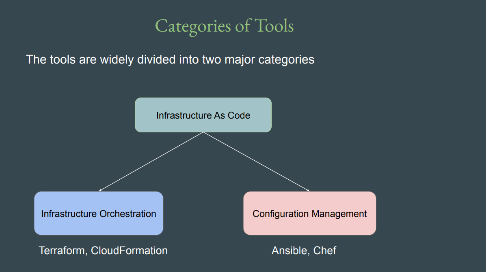

# Terraform Associate

- Terraform allows us to create reusable code that can deploy identical set of 
infrastructure in a repeatable fashion.[REF](https://github.com/zealvora/terraform-beginner-to-advanced-resource)

  

- Configuration Management :
    - Configuration Management tools are primarily used to maintain desired configuration of systems (inside servers)
        - Example: ALL servers should have Antivirus installed with version 10.0.2

- Infrastructure Orchestration
    - Infrastructure Orchestration is primarily used to create and manage infrastructure environments.
       - Example: Create 3 Servers with 4 GB RAM, 2 vCPUs. Each server should have firewall rule to allow SSH connection from Office IPs. 

 