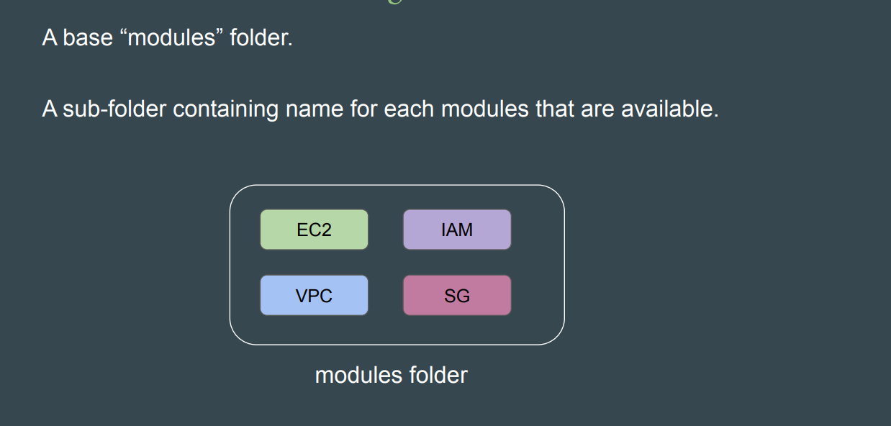
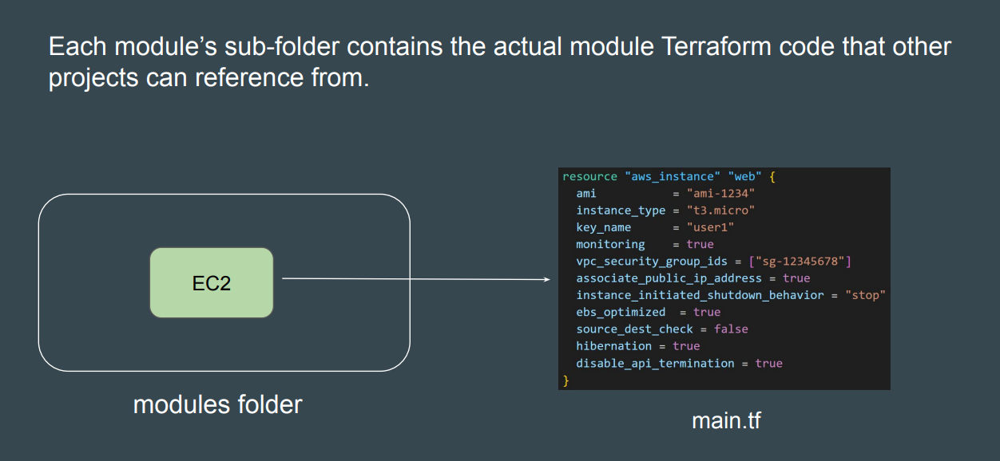

# Terraform Modules & Workspaces

## Terraform Modules

- Terraform Modules allows us to centralize the resource configuration and it makes it easier for multiple projects to re-use the Terraform code for projects.

- Base Module Structure for Custom Module

 
 