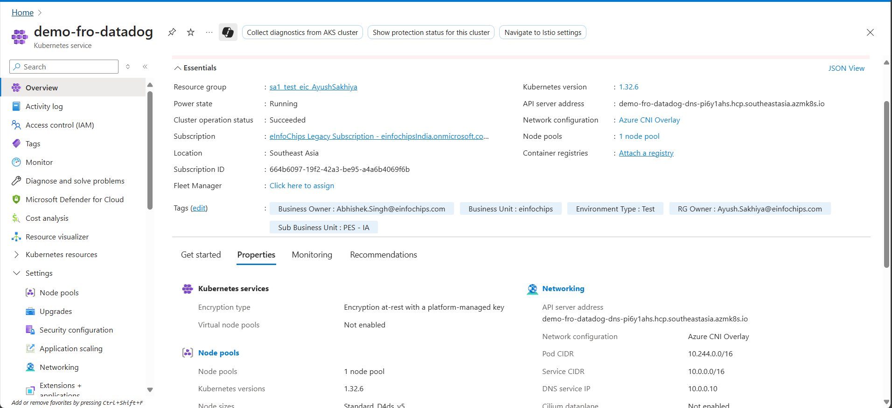

# AKS configuration with datadog 


- created AKS cluster on Azure portal



- now installing Datadog agent on AKS via Helm
```bash
  # Add DataDog Helm repository
helm repo add datadog https://helm.datadoghq.com
helm repo update

# Create namespace
kubectl create namespace datadog

# Create secret with API key
kubectl create secret generic datadog-secret \
  --from-literal api-key=<YOUR_DATADOG_API_KEY> \
  --namespace datadog
  ```
  
  
  

- created dashboard for cluster


- created alert for high cpu utilization of node


