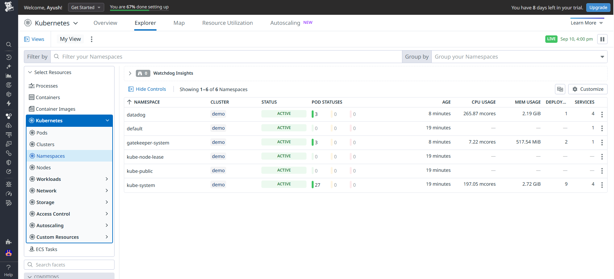

# minikube configuration with datadog monitoring (ubuntu vm)

1. Install Minikube and Kubectl 

- Install Docker Engine:
```bash
sudo apt update
sudo apt install docker.io -y
sudo usermod -aG docker $USER && newgrp docker
```

2. Download and Install Minikube: 

```bash
curl -LO https://storage.googleapis.com/minikube/releases/latest/minikube-linux-amd64

sudo install minikube-linux-amd64 /usr/local/bin/

rm minikube-linux-amd64
```
3. Install kubectl:
```bash

curl -LO "https://dl.k8s.io/release/$(curl -L -s https://dl.k8s.io/release/stable.txt)/bin/linux/amd64/kubectl"

sudo install -o root -g root -m 0755 kubectl /usr/local/bin/kubectl
```

4. Start Minikube: Start your single-node cluster using the Docker driver.
```bash
minikube start --driver=docker

```

5. Enable Datadog Monitoring with Helm 
```bash

curl https://raw.githubusercontent.com/helm/helm/main/scripts/get-helm-3 | bash

```

6. Add Datadog Helm repo
```bash
helm repo add datadog https://helm.datadoghq.com
helm repo update
```
7. Deploy Datadog Agent

Replace <DATADOG_API_KEY> with your actual key.
```bash
helm install datadog-agent datadog/datadog \
  --set datadog.apiKey=<DATADOG_API_KEY> \
  --set datadog.site='datadoghq.com' \
  --set targetSystem=linux
```
8. Verify Datadog Agent deployment
```bash
kubectl get pods -n default
```





